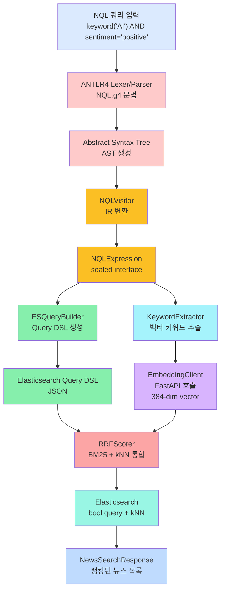
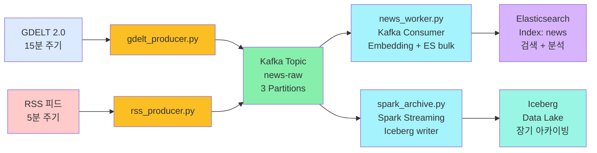
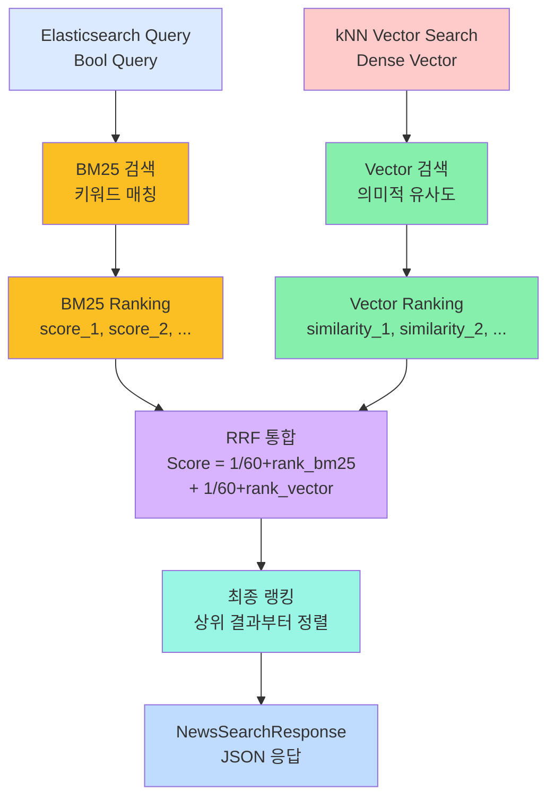

# N-QL Intelligence

**전문가용 뉴스 랭킹 엔진** — JQL 스타일 NQL(News Query Language)로 뉴스를 쿼리하고 하이브리드 스코어링(RRF)으로 최적의 결과 제공

---

## 개요

**N-QL Intelligence**는 자연스러운 쿼리 언어로 뉴스 검색 조건을 표현하고, 키워드 매칭과 의미적 유사도를 통합하는 하이브리드 검색 시스템입니다.

### 핵심 기능

- **NQL 쿼리 언어**: JQL 스타일의 직관적 문법으로 복잡한 검색 조건 표현
- **하이브리드 검색**: BM25(키워드) + Dense Vector(의미) 통합을 RRF로 스코어링
- **자동 데이터 파이프라인**: GDELT 2.0 + RSS → Kafka → Elasticsearch/Iceberg
- **모던 UI**: Next.js 기반 반응형 인터페이스

### 쿼리 예시

```sql
keyword("HBM") > 5 AND sentiment != "negative" AND source IN ["Reuters", "Bloomberg"]
```

---

## 기술 스택

| 계층 | 기술 |
|---|---|
| **쿼리 처리** | ANTLR4, Java 17 |
| **검색 엔진** | Elasticsearch 8.x |
| **데이터 수집** | Kafka, Python |
| **임베딩** | FastAPI, sentence-transformers |
| **장기 저장** | Apache Iceberg |
| **백엔드** | Spring Boot 3.x |
| **프론트엔드** | Next.js 14, React |

---

## 아키텍처

### 시스템 전체 구조

자세한 시각 자료는 [`docs/VISUAL_GUIDE.md`](docs/VISUAL_GUIDE.md)의 **전체 시스템 아키텍처** 섹션을 참고하세요.

### NQL 처리 파이프라인



**상세 예시 및 계산 과정:** [`docs/VISUAL_GUIDE.md`](docs/VISUAL_GUIDE.md#2-nql-쿼리-처리-플로우) 참고

---

### 데이터 파이프라인



**상세 설명:**

- [`docs/VISUAL_GUIDE.md`](docs/VISUAL_GUIDE.md#4-kafka-데이터-흐름) (Kafka 플로우)
- [`docs/VISUAL_GUIDE.md`](docs/VISUAL_GUIDE.md#5-데이터-저장소-비교) (ES vs Iceberg)

---

### RRF 스코어링 메커니즘

**BM25 (Keyword-based)** + **Vector Similarity (Semantic)**를 통합:



**상세 예시 및 계산 과정:** [`docs/VISUAL_GUIDE.md`](docs/VISUAL_GUIDE.md#3-rrf-reciprocal-rank-fusion-스코어링) 참고

---

## 디렉토리 구조

```
newsquery/
├── build.gradle                          # Gradle 빌드 설정
├── settings.gradle
├── README.md                             # 본 문서
├── docker-compose.yml                    # 인프라 (Kafka, ES, Zookeeper)
│
├── src/main/
│   ├── antlr4/com/newsquery/
│   │   └── NQL.g4                        # NQL 문법 정의 (핵심)
│   └── java/com/newsquery/
│       ├── nql/
│       │   ├── NQLExpression.java        # sealed interface IR
│       │   ├── NQLVisitorImpl.java        # AST → IR
│       │   ├── NQLQueryParser.java       # 통합 파싱/빌드
│       │   └── KeywordExtractor.java     # 벡터 임베딩 키워드 추출
│       ├── query/
│       │   └── ESQueryBuilder.java       # IR → ES Query DSL
│       ├── scoring/
│       │   └── RRFScorer.java            # RRF 스코어링
│       ├── embedding/
│       │   └── EmbeddingClient.java      # FastAPI 클라이언트
│       ├── search/
│       │   └── NewsSearchService.java    # 검색 로직
│       ├── api/
│       │   └── QueryController.java      # POST /api/query
│       └── config/
│           ├── ElasticsearchConfig.java  # ES 설정
│           └── WebConfig.java            # CORS 설정
│
├── src/test/java/com/newsquery/
│   ├── nql/
│   │   ├── NQLParserTest.java
│   │   ├── NQLVisitorTest.java
│   │   └── NQLExpressionTest.java
│   └── ...
│
├── pipeline/                             # Python 데이터 파이프라인
│   ├── config.py                         # 환경 변수 기반 설정
│   ├── gdelt_producer.py                 # GDELT 2.0 → Kafka
│   ├── rss_producer.py                   # RSS → Kafka
│   ├── news_worker.py                    # Kafka consumer → ES bulk
│   ├── spark_archive.py                  # Spark Structured Streaming → Iceberg
│   └── embedding_service.py              # FastAPI 임베딩 서비스
│
├── scripts/
│   ├── update_es_mapping.py              # content_vector 필드 추가
│   ├── ingest_sample.py                  # 샘플 데이터 로드
│   ├── setup_iceberg.py                  # Iceberg 초기화
│   ├── query_iceberg.py                  # Iceberg 조회
│   ├── run_spark_archive.bat/.sh         # spark-submit 래퍼
│   └── ...
│
├── frontend/                             # Next.js 프론트엔드
│   ├── app/
│   │   ├── page.tsx                      # 메인 페이지
│   │   ├── layout.tsx
│   │   └── components/
│   │       ├── SearchPanel.tsx           # 검색 UI
│   │       └── NewsCard.tsx              # 뉴스 카드
│   ├── public/
│   ├── package.json
│   └── .env.local
│
└── docs/
    ├── SETUP_GUIDE.md                    # 환경 설정 가이드
    └── diagrams/
        ├── architecture.excalidraw.json
        ├── data-pipeline.excalidraw.json
        └── rrf-scoring.excalidraw.json
```

---

## 빠른 시작 (Quick Start)

### 전제 조건

```bash
# Java 17 확인
java -version

# Python 3.9+ 확인
python --version

# Node.js 18+ 확인
node --version

# Docker 실행 확인
docker --version && docker-compose --version
```

### 1단계: 인프라 시작 (Docker Compose)

```bash
docker-compose up -d

# 상태 확인
docker-compose ps
```

**접근 가능한 서비스:**

- Elasticsearch: `http://localhost:9200`
- Kafka UI: `http://localhost:8888`

### 2단계: 백엔드 빌드 및 실행

```bash
# ANTLR4 파서 코드 생성 (NQL.g4 수정 후)
./gradlew generateGrammarSource

# 빌드
./gradlew build

# 테스트 실행
./gradlew test

# 개발 서버 실행 (port 8080)
./gradlew bootRun
```

### 3단계: 프론트엔드 실행

```bash
cd frontend

npm install

# 개발 서버 실행 (port 3000)
npm run dev

# 또는 프로덕션 빌드
npm run build && npm start
```

### 4단계: 데이터 파이프라인 (선택)

```bash
# Elasticsearch 매핑 설정
python scripts/update_es_mapping.py

# 임베딩 서비스 시작
python pipeline/embedding_service.py &

# Kafka Consumer 시작
python pipeline/news_worker.py &

# 데이터 프로듀서 시작
python pipeline/gdelt_producer.py  # GDELT
# 또는
python pipeline/rss_producer.py    # RSS
```

**전체 설정 가이드:** [`docs/SETUP_GUIDE.md`](docs/SETUP_GUIDE.md)

---

## API 문서

### POST /api/query

뉴스를 NQL 쿼리로 검색합니다.

**요청:**
```json
{
  "query": "keyword(\"artificial intelligence\") AND sentiment != \"negative\",
  "page": 1,
  "size": 20
}
```

**응답:**
```json
{
  "total": 156,
  "page": 1,
  "size": 20,
  "items": [
    {
      "id": "news_20240415_001",
      "title": "AI Breakthrough in Healthcare",
      "content": "Leading researchers announced...",
      "source": "Reuters",
      "sentiment": "positive",
      "publishedAt": "2024-04-15T10:30:00Z",
      "rffScore": 1.25,
      "category": "TECHNOLOGY",
      "country": "US"
    },
    ...
  ]
}
```

| 필드 | 타입 | 설명 |
|---|---|---|
| `query` | string | NQL 쿼리 |
| `page` | int | 페이지 번호 (기본값: 1) |
| `size` | int | 페이지당 결과 수 (기본값: 20) |

---

## NQL 쿼리 문법

### 지원 필드

| 필드 | 타입 | 예시 |
|---|---|---|
| `keyword` | text | `keyword("AI", "machine learning")` |
| `sentiment` | keyword | `sentiment = "positive"` |
| `source` | keyword | `source IN ["Reuters", "Bloomberg"]` |
| `category` | keyword | `category = "CONFLICT"` |
| `country` | keyword | `country = "US"` |
| `publishedAt` | date | `publishedAt >= "2024-01-01"` |
| `score` | float | `score > 5.0` |

### 연산자 및 문법

| 연산자 | 설명 | 예시 |
|---|---|---|
| `AND` `OR` `NOT` | 논리 연산 | `keyword("AI") AND sentiment = "positive"` |
| `>` `>=` `<` `<=` | 비교 | `score >= 7.5` |
| `=` `!=` | 동등성 | `sentiment != "neutral"` |
| `IN` | 목록 포함 | `source IN ["CNN", "BBC"]` |
| `*` | 모든 문서 | `*` |

### 쿼리 예제

```sql
-- 1. 단순 키워드 검색
keyword("blockchain")

-- 2. 다중 키워드 + 감정 필터
keyword("earnings") AND sentiment = "positive"

-- 3. 출처 제한
source IN ["Reuters", "Bloomberg"] AND keyword("technology")

-- 4. 날짜 범위
publishedAt >= "2024-01-01" AND publishedAt < "2024-12-31"

-- 5. 복합 조건 (괄호 사용)
(keyword("CEO") OR keyword("leadership")) 
AND NOT sentiment = "negative" 
AND source IN ["Fortune", "WSJ"]

-- 6. 모든 문서 조회
*
```

---

## 설정 및 매개변수

### Elasticsearch 설정

**파일:** `src/main/resources/application.properties`

```properties
# Elasticsearch 연결
spring.elasticsearch.uris=http://localhost:9200

# 인덱스명
elasticsearch.index.name=news

# 임베딩 필드
elasticsearch.vector.field=content_vector
elasticsearch.vector.dimension=384
elasticsearch.vector.similarity=cosine
```

| 설정 | 값 | 설명 |
|---|---|---|
| **Host** | `localhost:9200` | Elasticsearch 서버 주소 |
| **Index** | `news` | 뉴스 인덱스 |
| **Vector Dims** | 384 | MiniLM-L6-v2 모델 크기 |
| **Similarity** | cosine | 벡터 유사도 함수 |

### RRF 스코어링 설정

**파일:** `src/main/java/com/newsquery/scoring/RRFScorer.java`

```java
private static final int RANK_CONSTANT = 60;        // RRF 상수
private static final int RANK_WINDOW_SIZE = 100;    // 윈도우 크기
private static final int K_NN = 100;                 // 벡터 검색 k
private static final int NUM_CANDIDATES = 100;      // 후보 수
```

| 매개변수 | 값 | 설명 |
|---|---|---|
| **rank_constant** | 60 | RRF 공식의 상수항 (문서 순위 정규화) |
| **rank_window_size** | 100 | 고려할 상위 문서 개수 |
| **kNN k** | 100 | 벡터 검색 결과 수 |
| **num_candidates** | 100 | 후보 수 (성능 최적화) |

### Python 파이프라인 설정

**파일:** `pipeline/config.py`

```python
# 환경 변수로 설정 (기본값)
ES_HOST = os.getenv("ES_HOST", "localhost:9200")
KAFKA_BROKERS = os.getenv("KAFKA_BROKERS", "localhost:9092")
EMBEDDING_SERVICE_URL = os.getenv("EMBEDDING_SERVICE_URL", "http://localhost:8000")

# GDELT/RSS 주기
GDELT_INTERVAL = 15  # 분
RSS_INTERVAL = 5     # 분

# Kafka 토픽
KAFKA_TOPIC = "news-raw"
```

---

## 테스트

### 전체 테스트 실행

```bash
./gradlew test
```

### 특정 테스트 클래스 실행

```bash
./gradlew test --tests "com.newsquery.nql.NQLParserTest"
```

### 특정 테스트 메서드 실행

```bash
./gradlew test --tests "com.newsquery.nql.NQLParserTest.testKeywordQuery"
```

### 테스트 리포트 확인

```bash
# Linux/Mac
open build/reports/tests/test/index.html

# Windows
start build\reports\tests\test\index.html
```

---

## Elasticsearch 데이터 관리

### 매핑 확인

```bash
curl http://localhost:9200/news/_mapping | jq
```

### content_vector 필드 추가 (필수)

```bash
python scripts/update_es_mapping.py
```

### 샘플 데이터 인덱싱

```bash
python scripts/ingest_sample.py
```

출력 예:
```
✓ Successfully indexed 200 news documents
Index stats: 200 documents, 1.2 MB
```

### 인덱스 통계 조회

```bash
curl http://localhost:9200/news/_stats | jq '.indices.news'
```

---

## Iceberg 데이터 관리

### 초기화 (원타임)

```bash
python scripts/setup_iceberg.py
```

**동작:**
- Hadoop winutils 자동 다운로드 (Windows)
- Iceberg 테이블 생성
- 파티션 스키마 설정

### 데이터 조회

```bash
# 최근 100개 문서 조회
python scripts/query_iceberg.py --recent 100

# 현재 스냅샷 통계
python scripts/query_iceberg.py --stats

# 스냅샷 히스토리
python scripts/query_iceberg.py --snapshot
```

---

## 디버깅

### Elasticsearch 연결 오류

```bash
# 서비스 상태 확인
curl http://localhost:9200

# 응답 예
{
  "name": "...",
  "version": {"number": "8.12.0"},
  "status": "green"
}

# 로그 확인
docker logs newsquery-elasticsearch
```

### Kafka 연결 오류

```bash
# 브로커 상태 확인
docker exec newsquery-kafka kafka-broker-api-versions.sh --bootstrap-server localhost:9092

# 토픽 생성 확인
docker exec newsquery-kafka kafka-topics.sh --bootstrap-server localhost:9092 --list
```

### 임베딩 서비스 오류

```bash
# 서비스 상태 확인
curl http://localhost:8000/health

# 임베딩 테스트
curl -X POST http://localhost:8000/embed/single \
  -H "Content-Type: application/json" \
  -d '{"text": "artificial intelligence"}'
```

### Spring Boot 로그 확인

```bash
# 콘솔 로그 (bootRun 사용 시 자동 출력)
# 또는 파일 로그
tail -f logs/application.log
```

---

## 주요 설계 결정

### 1. Java 17 패턴 매칭

`NQLExpression` sealed interface 처리에 `instanceof` 패턴 매칭 사용:

```java
NQLExpression expr = ...;
if (expr instanceof KeywordExpr ke) {
    // 키워드 표현식 처리
} else if (expr instanceof ComparisonExpr ce) {
    // 비교 표현식 처리
}
```

**이점:** 명확한 타입 체크, 컴파일 타임 안전성

### 2. EmbeddingClient의 Graceful Degradation

임베딩 서비스 장애 시 BM25 단독 검색으로 자동 전환:

```java
float[] vector = embeddingClient.embed(keyword);
if (vector == null) {
    // 임베딩 실패 → BM25만 사용 가능
    return searchService.search(query);
}
```

**이점:** 서비스 안정성, 사용자 경험 유지

### 3. at-least-once 처리 보장 (Kafka)

`news_worker.py`에서:
- `enable.auto.commit=False` (수동 커밋)
- Elasticsearch bulk 성공 후에만 커밋
- 실패 시 자동 재처리

```python
consumer = KafkaConsumer(
    enable_auto_commit=False,
    auto_offset_reset='earliest'
)

try:
    es.bulk(body=bulk_body)  # ES 저장 성공
    consumer.commit()         # 그 후 커밋
except:
    # 실패 시 미처리 상태 유지 → 재처리
    pass
```

### 4. RRF를 통한 하이브리드 검색

BM25 + Vector Similarity의 두 순위를 통합:

```
RRF Score = 1/(60 + BM25_rank) + 1/(60 + vector_rank)
```

**이점:**
- 키워드 정확도 + 의미 이해 모두 반영
- 어느 한쪽이 실패해도 다른 신호로 보완

---

## 배포 가이드

### Docker 이미지 빌드 (Spring Boot)

**Dockerfile:**
```dockerfile
FROM openjdk:17-slim

WORKDIR /app
COPY build/libs/newsquery-*.jar app.jar

EXPOSE 8080
ENTRYPOINT ["java", "-jar", "app.jar"]
```

**빌드 및 실행:**
```bash
docker build -t newsquery:latest .
docker run -p 8080:8080 -e SPRING_ELASTICSEARCH_URIS=http://host.docker.internal:9200 newsquery:latest
```

### Docker 이미지 빌드 (Next.js)

**Dockerfile:**
```dockerfile
FROM node:18-alpine

WORKDIR /app
COPY frontend .

RUN npm install && npm run build

EXPOSE 3000
ENV NEXT_PUBLIC_API_URL=http://localhost:8080

CMD ["npm", "start"]
```

### Kubernetes 배포 예시

**deployment.yaml:**
```yaml
apiVersion: apps/v1
kind: Deployment
metadata:
  name: newsquery-backend
spec:
  replicas: 2
  selector:
    matchLabels:
      app: newsquery-backend
  template:
    metadata:
      labels:
        app: newsquery-backend
    spec:
      containers:
      - name: backend
        image: newsquery:latest
        ports:
        - containerPort: 8080
        env:
        - name: SPRING_ELASTICSEARCH_URIS
          value: "http://elasticsearch:9200"
```

---

## 환경 변수

### Backend (application.properties)

```properties
spring.elasticsearch.uris=http://localhost:9200
spring.application.name=newsquery
server.port=8080
logging.level.com.newsquery=DEBUG
```

### Python (pipeline/config.py)

```python
ES_HOST=localhost:9200
KAFKA_BROKERS=localhost:9092
EMBEDDING_SERVICE_URL=http://localhost:8000
GDELT_API_KEY=your_api_key
```

### Frontend (.env.local)

```env
NEXT_PUBLIC_API_URL=http://localhost:8080
```

---

## 🎓 기술 심화 학습 가이드

**기술 면접 또는 깊이 있는 학습을 원하시나요?**

이 프로젝트의 전체 기술 여정을 4개 시리즈로 체계적으로 정리했습니다 (~4시간).

### 📚 시리즈 구성

| 시리즈 | 제목 | 난이도 | 시간 | 핵심 내용 |
|--------|------|--------|------|---------|
| **Series 01** | [아키텍처 설계](docs/TECH_INTERVIEW_GUIDE_SERIES_01_ARCHITECTURE.md) | ⭐⭐⭐ | 45분 | ANTLR4, sealed interface, RRF 하이브리드 검색 |
| **Series 02** | [Phase 1: 에러 처리 & 모니터링](docs/TECH_INTERVIEW_GUIDE_SERIES_02_PHASE1_ERROR_HANDLING.md) | ⭐⭐ | 40분 | @ExceptionHandler, Prometheus, Grafana |
| **Series 03** | [Phase 2: 고급 연산자](docs/TECH_INTERVIEW_GUIDE_SERIES_03_PHASE2_OPERATORS.md) | ⭐⭐⭐ | 50분 | BETWEEN, CONTAINS, LIKE 구현 및 성능 |
| **Series 04** | [Phase 4-5: 성능 최적화 & 이벤트](docs/TECH_INTERVIEW_GUIDE_SERIES_04_PHASE4_5_OPTIMIZATION.md) | ⭐⭐⭐⭐ | 60분 | 2-계층 캐싱, Cold vs Warm, 이벤트 패턴 |

### 🎯 빠른 시작

```bash
# 전체 인덱스 보기
cat docs/TECH_INTERVIEW_GUIDE_INDEX.md

# Series별 학습 (순서대로 권장)
1️⃣ Series 01: 아키텍처 (전체 개요 이해)
2️⃣ Series 02: Phase 1 (운영 기초)
3️⃣ Series 03: Phase 2 (구체적 구현)
4️⃣ Series 04: Phase 4-5 (최적화 & 확장)
```

### 💡 각 시리즈의 특징

- **상세한 설계 결정 근거**: "왜 이 기술을 선택했는가?"
- **코드 예시**: 실제 구현 코드 포함
- **성능 데이터**: 실측 벤치마크 결과
- **면접 Q&A**: 예상 질문과 모범 답변 (총 17개)
- **학습 경로**: 초급/중급/고급별 추천 순서

---

## 참고 자료

- [ANTLR4 공식 문서](https://www.antlr.org/)
- [Elasticsearch 공식 문서](https://www.elastic.co/guide/en/elasticsearch/reference/current/)
- [Spring Boot 공식 문서](https://spring.io/projects/spring-boot)
- [Next.js 공식 문서](https://nextjs.org/docs)
- [Apache Kafka 공식 문서](https://kafka.apache.org/)
- [Apache Spark 공식 문서](https://spark.apache.org/)
- [Apache Iceberg 공식 문서](https://iceberg.apache.org/)
- [Excalidraw 다이어그램 편집기](https://excalidraw.com)

---

## 문제 해결 (FAQ)

**Q: Elasticsearch 연결이 안 됩니다.**
A: `docker-compose ps`로 Elasticsearch 컨테이너 상태를 확인하고, `curl http://localhost:9200`으로 응답을 확인하세요.

**Q: NQL 쿼리가 파싱되지 않습니다.**
A: ANTLR4 문법 파일(`NQL.g4`) 변경 후 `./gradlew generateGrammarSource`를 실행했는지 확인하세요.

**Q: 임베딩 벡터가 생성되지 않습니다.**
A: FastAPI 임베딩 서비스(`python pipeline/embedding_service.py`)가 실행 중인지 확인하고, `curl http://localhost:8000/health`로 상태를 확인하세요. 실패 시 BM25만으로 검색됩니다.

**Q: Kafka 메시지가 처리되지 않습니다.**
A: `docker exec newsquery-kafka kafka-console-consumer.sh --bootstrap-server localhost:9092 --topic news-raw`로 메시지를 확인하세요.

---

---

## 문서 네비게이션

**전체 문서 인덱스:** [`docs/INDEX.md`](docs/INDEX.md)

| 문서 | 용도 |
| --- | --- |
| **[빠른 참고서](docs/QUICK_REFERENCE.md)** | 자주 사용되는 명령어, API, 쿼리 치트시트 |
| **[시각적 가이드](docs/VISUAL_GUIDE.md)** | 전체 아키텍처, 플로우, 다이어그램 |
| **[스크린샷 가이드](docs/SCREENSHOTS_GUIDE.md)** | 각 단계별 실행 화면 및 예상 출력 |
| **[환경 설정](docs/SETUP_GUIDE.md)** | 단계별 환경 구성 방법 |
| **[Excalidraw 다이어그램](docs/diagrams/)** | 편집 가능한 시스템 다이어그램 |

---

**마지막 업데이트:** 2026-04-22  
**개발팀:** 2026b101@gmail.com
