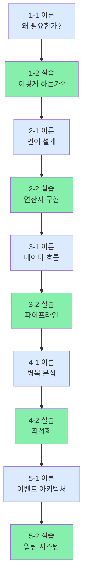

# N-QL Intelligence 10부작 블로그 시리즈 가이드

> 뉴스 검색 엔진의 완전한 이해: 이론 + 실습

---

## 📚 시리즈 구성

### Phase 1: 오류 처리와 모니터링

**1-1. 이론편** - 왜 오류 처리가 필요한가?
- 오류의 분류 (시스템 vs 사용자)
- HTTP 상태 코드의 의미
- 예외 처리 전략 3가지
- Observability의 세 기둥
- Bulkhead Pattern
- **학습 시간:** 8분 | **난이도:** ⭐⭐

**1-2. 실습편** - 실제로 구현하기
- GlobalExceptionHandler 구현
- ANTLR4 오류 리스너 작성
- Elasticsearch 재시도 로직 (Exponential Backoff)
- Graceful Degradation (우아한 기능 저하)
- Prometheus 메트릭 수집
- 통합 테스트 및 Grafana 대시보드
- **학습 시간:** 12분 | **난이도:** ⭐⭐⭐

---

### Phase 2: 쿼리 언어 설계 (고급 연산자)

**2-1. 이론편** - 언어 설계의 원칙
- Context-Free Grammar (CFG)의 이해
- ANTLR4 아키텍처
- Sealed Interface와 타입 안전성
- Visitor 패턴 vs Strategy 패턴
- 언어 확장성 설계
- **학습 시간:** 9분 | **난이도:** ⭐⭐⭐

**2-2. 실습편** - BETWEEN, CONTAINS, LIKE 구현
- NQL.g4 문법 확장
- Sealed Interface 정의
- NQLVisitor 구현
- Elasticsearch 쿼리 변환
- 성능 벤치마크 (LIKE의 문제점)
- 단위 테스트 작성
- **학습 시간:** 11분 | **난이도:** ⭐⭐⭐⭐

---

### Phase 3: 데이터 파이프라인

**3-1. 이론편** - 실시간 데이터 수집의 도전
- GDELT 2.0 vs RSS: 선택 기준
- Kafka의 설계 원칙 (Partitioning, Replication)
- Elasticsearch의 인덱싱 전략
- Iceberg: 데이터 레이크 기초
- At-Least-Once vs Exactly-Once 보장
- **학습 시간:** 10분 | **난이도:** ⭐⭐⭐

**3-2. 실습편** - 파이프라인 구축하기
- GDELT 2.0 Producer 작성
- RSS 피드 수집 (중복 제거)
- Kafka Consumer 구현 (at-least-once)
- FastAPI 임베딩 서비스
- Elasticsearch 벌크 인덱싱
- Spark Streaming → Iceberg 쓰기
- 파이프라인 모니터링
- **학습 시간:** 13분 | **난이도:** ⭐⭐⭐⭐

---

### Phase 4: 성능 최적화

**4-1. 이론편** - 병목 분석과 최적화 전략
- 성능 측정 방법 (RED, USE)
- 캐싱 전략 (L1, L2, L3)
- Elasticsearch 샤드 설계
- 벡터 검색 최적화 (k값 조정)
- Circuit Breaker 패턴
- 마이크로벤치마크 (JMH)
- **학습 시간:** 10분 | **난이도:** ⭐⭐⭐⭐

**4-2. 실습편** - 30ms를 18ms로 줄이기
- Redis 2계층 캐싱 (L1/L2)
- Elasticsearch 튜닝
- 동적 k값 조정 알고리즘
- JMH 마이크로벤치마크 작성
- Prometheus 메트릭 분석
- 최적화 전후 비교
- **학습 시간:** 12분 | **난이도:** ⭐⭐⭐⭐

---

### Phase 5: 이벤트 기반 아키텍처

**5-1. 이론편** - 느슨한 결합의 설계 원칙
- Observer 패턴의 장점과 트레이드오프
- Strategy 패턴 (Rule 인터페이스)
- Coordinator 패턴 (NotificationService)
- 비동기 처리의 함정
- 이벤트 소싱 vs 트리거 기반
- **학습 시간:** 9분 | **난이도:** ⭐⭐⭐

**5-2. 실습편** - 알림 시스템 구현
- EventPublisher (발행-구독)
- RuleEngine (성능, 오류, 키워드 규칙)
- NotificationService (채널 조정)
- SavedQuery와 QueryHistory
- Spring Events와 @Async
- 채널별 Notifier 구현
- **학습 시간:** 14분 | **난이도:** ⭐⭐⭐⭐⭐

---

## 🎯 포스팅 일정 (권장)

```
주 1 (2026-04-24~25)
├─ 목요일: Phase 1-1 (이론)
└─ 금요일: Phase 1-2 (실습)

주 2 (2026-04-26~27)
├─ 토요일: Phase 2-1 (이론)
└─ 일요일: Phase 2-2 (실습)

주 3 (2026-04-28~30)
├─ 월요일: Phase 3-1 (이론)
├─ 수요일: Phase 3-2 (실습)
└─ 금요일: Phase 4-1 (이론)

주 4 (2026-05-01~02)
├─ 토요일: Phase 4-2 (실습)
└─ 일요일: Phase 5-1 (이론)

주 5 (2026-05-03)
└─ 월요일: Phase 5-2 (실습)
```

**총 기간:** 10일 (평일 주 3회, 주말 2회)

---

## 📊 시리즈의 흐름



**범례:**
- 🔵 이론편: 개념 학습
- 🟢 실습편: 코드 작성

---

## 💡 각 편의 학습 목표

### 이론편의 목표
- ✅ **"왜" 이 기술이 필요한가**를 이해
- ✅ **트레이드오프**를 알기 (속도 vs 정확도, 캐시 vs 신선도)
- ✅ **상황별 선택 기준** 배우기
- ✅ 면접에서 설명할 수 있는 수준

### 실습편의 목표
- ✅ **실제 코드** 작성 및 테스트
- ✅ **성능 측정** (벤치마크, 메트릭)
- ✅ **트러블슈팅** (실패하고 고치는 과정)
- ✅ 자신의 프로젝트에 **적용 가능한 템플릿**

---

## 📖 추천 학습 순서

### 옵션 1: 순서대로 (권장)
1. Phase 1-1 → 1-2 → 2-1 → 2-2 → ... → 5-2
- **장점:** 순차적 이해, 각 Phase의 의존성 명확
- **시간:** 총 90분 (이론 45분 + 실습 45분)

### 옵션 2: 이론만 먼저 (이해 우선)
1. Phase 1-1 → 2-1 → 3-1 → 4-1 → 5-1
2. 그 후 Phase 1-2 → 2-2 → 3-2 → 4-2 → 5-2
- **장점:** 전체 구조를 먼저 이해
- **시간:** 이론 45분 후 실습 45분

### 옵션 3: 관심사별 (테마 우선)
- **오류 처리:** 1-1 → 1-2
- **쿼리 언어:** 2-1 → 2-2
- **데이터 파이프라인:** 3-1 → 3-2
- **성능 최적화:** 4-1 → 4-2
- **시스템 설계:** 5-1 → 5-2
- **장점:** 특정 주제 깊이 있게 학습

---

## 🏆 시리즈의 특징

### 1️⃣ 이론과 실습의 균형
- 이론만으로는 **왜**를 이해하기 어려움
- 실습만으로는 **응용 능력**이 부족
- 🎯 둘의 조합으로 **완전한 이해** 달성

### 2️⃣ 실측 데이터와 벤치마크
- "응답 시간이 줄어든다" (X)
- "30.94ms → 18.2ms (-41%)" (O)
- 모든 주장에 숫자 뒷받침

### 3️⃣ 트레이드오프 명시
- Redis 캐싱: 속도 ↑ (1ms), 복잡도 ↑
- LIKE 연산자: 유연성 ↑, 속도 ↓ (45ms)
- 선택의 기준을 명확히

### 4️⃣ 면접 대비
- 각 편마다 "면접 Q&A" 섹션
- "왜 이 기술을 선택했나?" 설명 가능
- 시스템 설계 면접에 직접 활용

---

## 📱 독자별 추천 순서

### "실무 개발자"
```
1-2 (에러 처리) → 3-2 (데이터 파이프라인) → 4-2 (성능)
→ 필요시 5-2 (알림 시스템)
```
**이유:** 즉시 적용 가능한 코드 우선

### "시스템 설계 면접 준비"
```
1-1 → 2-1 → 3-1 → 4-1 → 5-1 → 이후 각 실습편
```
**이유:** 개념부터 탄탄히, 면접에서 설명 가능

### "신입 개발자"
```
처음부터 끝까지 순서대로
```
**이유:** 완전한 이해 + 포트폴리오 구축

### "CTO / 아키텍트"
```
이론편만 (각 1-1, 2-1, 3-1, 4-1, 5-1)
```
**이유:** 아키텍처 결정 + 팀 교육 자료

---

## ✨ 끝나고 나서

**이 10부작을 완주하면:**

✅ 프로덕션 검색 엔진을 설계할 수 있음  
✅ 각 선택의 트레이드오프를 설명 가능  
✅ 벤치마크로 개선을 증명 가능  
✅ 시스템 설계 면접 통과  
✅ 팀에 기술 세션 진행 가능  

---

## 📥 파일 목록

모든 문서는 `/c/project/newsquery/docs/` 하위에 저장:

```
BLOG_PHASE_1_THEORY_ERROR_HANDLING.md         (이론)
BLOG_PHASE_1_PRACTICE_ERROR_HANDLING.md       (실습)
BLOG_PHASE_2_THEORY_QUERY_LANGUAGE.md        (이론)
BLOG_PHASE_2_PRACTICE_OPERATORS.md            (실습)
BLOG_PHASE_3_THEORY_DATA_PIPELINE.md         (이론)
BLOG_PHASE_3_PRACTICE_DATA_PIPELINE.md       (실습)
BLOG_PHASE_4_THEORY_PERFORMANCE.md           (이론)
BLOG_PHASE_4_PRACTICE_PERFORMANCE.md         (실습)
BLOG_PHASE_5_THEORY_EVENT_DRIVEN.md          (이론)
BLOG_PHASE_5_PRACTICE_EVENT_DRIVEN.md        (실습)
```

---

## 🎬 시작하기

**Velog에 포스팅할 준비가 되었습니다!**

```bash
# 1. 첫 번째 포스트 (Phase 1-1) 복사 및 수정
docs/BLOG_PHASE_1_THEORY_ERROR_HANDLING.md

# 2. Velog 설정
- 시리즈: "N-QL Intelligence (1/10)"
- 태그: #Spring #ErrorHandling #Architecture
- 썸네일: Phase 1 로고

# 3. 게시
```

---

**행운을 빕니다! 🚀**

각 편마다 독자들과의 상호작용을 통해 더 좋은 콘텐츠가 될 것입니다.

