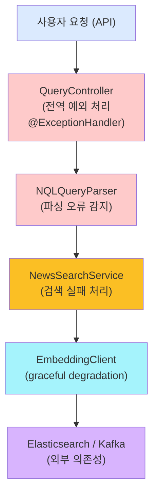

# Phase 1: 뉴스 검색 엔진의 오류 처리와 모니터링 시스템 구축

> **시리즈:** N-QL Intelligence 블로그 | **난이도:** ⭐⭐ | **읽는 시간:** 10분

---

## 소개

안녕하세요 👋 뉴스 검색 엔진 **N-QL Intelligence** 개발 여정을 블로그로 공유합니다.

이 시리즈는 5개의 개발 단계(Phase)를 따릅니다. **Phase 1**에서는 **프로덕션 준비 단계**로 안정적인 오류 처리와 모니터링 시스템을 구축합니다.

---

## Phase 1 개요: 왜 오류 처리가 중요한가?

뉴스 검색 엔진은 24/7 실시간으로 동작해야 합니다. 

- 🔴 Elasticsearch가 다운되면?
- 🔴 사용자 입력이 잘못된 NQL 쿼리면?
- 🔴 외부 임베딩 서비스가 응답하지 않으면?

이런 상황에서 서버가 500 에러를 반환하거나 무한 로딩을 보여주면 사용자 경험이 최악입니다.

**Phase 1의 목표:**
1. ✅ 모든 에러를 체계적으로 처리
2. ✅ 사용자에게 명확한 에러 메시지 전달
3. ✅ 운영팀이 문제를 빠르게 파악할 수 있는 모니터링 시스템 구축

---

## 아키텍처: 계층별 오류 처리



---

## 구현 1: 전역 예외 처리기 (Global Exception Handler)

### 1-1. 사용자 정의 예외 클래스

먼저 도메인별로 예외를 정의합니다:

```java
// 파싱 오류
public class NQLParsingException extends RuntimeException {
    public NQLParsingException(String message) {
        super(message);
    }
    
    public NQLParsingException(String message, Throwable cause) {
        super(message, cause);
    }
}

// Elasticsearch 오류
public class SearchException extends RuntimeException {
    public SearchException(String message) {
        super(message);
    }
}

// 임베딩 서비스 오류 (비치명적)
public class EmbeddingException extends RuntimeException {
    public EmbeddingException(String message) {
        super(message);
    }
}
```

### 1-2. 글로벌 예외 처리기

Spring의 `@ExceptionHandler`를 활용합니다:

```java
@RestControllerAdvice
public class GlobalExceptionHandler {
    
    private static final Logger logger = LoggerFactory.getLogger(GlobalExceptionHandler.class);
    
    // 1. NQL 파싱 오류 (400 Bad Request)
    @ExceptionHandler(NQLParsingException.class)
    @ResponseStatus(HttpStatus.BAD_REQUEST)
    public ErrorResponse handleNQLParsingException(NQLParsingException ex) {
        logger.warn("NQL parsing error: {}", ex.getMessage());
        return ErrorResponse.of(
            "INVALID_QUERY",
            ex.getMessage(),
            HttpStatus.BAD_REQUEST.value()
        );
    }
    
    // 2. 검색 오류 (503 Service Unavailable)
    @ExceptionHandler(SearchException.class)
    @ResponseStatus(HttpStatus.SERVICE_UNAVAILABLE)
    public ErrorResponse handleSearchException(SearchException ex) {
        logger.error("Search service error: {}", ex.getMessage(), ex);
        return ErrorResponse.of(
            "SEARCH_FAILED",
            "검색 서비스가 일시적으로 사용 불가능합니다. 잠시 후 다시 시도하세요.",
            HttpStatus.SERVICE_UNAVAILABLE.value()
        );
    }
    
    // 3. 예상 못 한 오류 (500 Internal Server Error)
    @ExceptionHandler(Exception.class)
    @ResponseStatus(HttpStatus.INTERNAL_SERVER_ERROR)
    public ErrorResponse handleUnexpectedException(Exception ex) {
        logger.error("Unexpected error: {}", ex.getMessage(), ex);
        return ErrorResponse.of(
            "INTERNAL_ERROR",
            "내부 서버 오류가 발생했습니다.",
            HttpStatus.INTERNAL_SERVER_ERROR.value()
        );
    }
}

// 응답 DTO
record ErrorResponse(
    String code,
    String message,
    int status,
    long timestamp
) {
    public static ErrorResponse of(String code, String message, int status) {
        return new ErrorResponse(code, message, status, System.currentTimeMillis());
    }
}
```

### 1-3. API 응답 형식

**성공 응답:**
```json
{
  "total": 156,
  "page": 1,
  "size": 20,
  "items": [...]
}
```

**오류 응답:**
```json
{
  "code": "INVALID_QUERY",
  "message": "Unexpected token: 'XYZ'",
  "status": 400,
  "timestamp": 1713945600000
}
```

---

## 구현 2: NQL 파싱 오류 처리

### 2-1. ANTLR 오류 리스너 커스터마이징

ANTLR4의 기본 에러 리스너를 오버라이드합니다:

```java
public class NQLErrorListener extends BaseErrorListener {
    
    private StringBuilder errors = new StringBuilder();
    
    @Override
    public void syntaxError(
        Recognizer<?, ?> recognizer,
        Object offendingSymbol,
        int line,
        int charPositionInLine,
        String msg,
        RecognitionException e
    ) {
        String error = String.format(
            "Line %d, Column %d: %s",
            line, charPositionInLine, msg
        );
        errors.append(error).append("\n");
    }
    
    public boolean hasErrors() {
        return errors.length() > 0;
    }
    
    public String getErrors() {
        return errors.toString();
    }
}

// NQLQueryParser에서 사용
public NQLExpression parseToExpression(String queryString) 
        throws NQLParsingException {
    
    ANTLRInputStream input = new ANTLRInputStream(queryString);
    NQLLexer lexer = new NQLLexer(input);
    CommonTokenStream tokens = new CommonTokenStream(lexer);
    NQLParser parser = new NQLParser(tokens);
    
    // 커스텀 에러 리스너 설정
    NQLErrorListener errorListener = new NQLErrorListener();
    parser.removeErrorListeners();
    parser.addErrorListener(errorListener);
    
    // 파싱
    NQLParser.QueryContext ctx = parser.query();
    
    // 에러 확인
    if (errorListener.hasErrors()) {
        throw new NQLParsingException(
            "Failed to parse NQL query:\n" + errorListener.getErrors()
        );
    }
    
    // AST → IR 변환
    return new NQLVisitorImpl().visit(ctx);
}
```

### 2-2. 파싱 오류 예시

사용자가 잘못된 쿼리를 입력했을 때:

```sql
-- 잘못된 쿼리
keyword("AI") AND sentiment = "INVALID_VALUE"
```

**응답:**
```json
{
  "code": "INVALID_QUERY",
  "message": "Failed to parse NQL query:\nLine 1, Column 31: Unexpected token: 'INVALID_VALUE'",
  "status": 400,
  "timestamp": 1713945600000
}
```

---

## 구현 3: Elasticsearch 연결 오류 처리

### 3-1. 재시도 로직 (Retry Mechanism)

```java
@Service
public class NewsSearchService {
    
    private static final Logger logger = LoggerFactory.getLogger(NewsSearchService.class);
    private static final int MAX_RETRIES = 3;
    private static final long RETRY_DELAY_MS = 500;
    
    private final ElasticsearchClient esClient;
    
    // 재시도 기능이 있는 검색
    public NewsSearchResponse searchWithRRF(NQLExpression expr, int page, int size) {
        int attempt = 0;
        SearchException lastException = null;
        
        while (attempt < MAX_RETRIES) {
            try {
                attempt++;
                logger.debug("Search attempt {}/{}", attempt, MAX_RETRIES);
                
                // 실제 검색
                return performSearch(expr, page, size);
                
            } catch (IOException | ElasticsearchException ex) {
                lastException = new SearchException(
                    "Elasticsearch request failed: " + ex.getMessage(),
                    ex
                );
                
                if (attempt < MAX_RETRIES) {
                    logger.warn("Search failed (attempt {}/{}), retrying in {}ms", 
                        attempt, MAX_RETRIES, RETRY_DELAY_MS);
                    
                    try {
                        Thread.sleep(RETRY_DELAY_MS);
                    } catch (InterruptedException ie) {
                        Thread.currentThread().interrupt();
                        throw new SearchException("Search interrupted", ie);
                    }
                }
            }
        }
        
        // 모든 재시도 실패
        logger.error("Search failed after {} attempts", MAX_RETRIES);
        throw lastException;
    }
    
    private NewsSearchResponse performSearch(NQLExpression expr, int page, int size) 
            throws IOException {
        // 실제 검색 로직
        // ...
    }
}
```

### 3-2. Circuit Breaker 패턴 (고급)

연속된 오류가 발생하면 요청을 즉시 거절하는 패턴:

```java
@Service
public class CircuitBreakerSearchService {
    
    enum CircuitState { CLOSED, OPEN, HALF_OPEN }
    
    private CircuitState state = CircuitState.CLOSED;
    private int failureCount = 0;
    private static final int FAILURE_THRESHOLD = 5;
    private long lastFailureTime = 0;
    private static final long TIMEOUT_MS = 30000; // 30초
    
    public NewsSearchResponse search(NQLExpression expr, int page, int size) {
        // 서킷 브레이커 상태 확인
        if (state == CircuitState.OPEN) {
            // 타임아웃 확인
            if (System.currentTimeMillis() - lastFailureTime > TIMEOUT_MS) {
                state = CircuitState.HALF_OPEN;
                failureCount = 0;
            } else {
                throw new SearchException(
                    "Circuit breaker is OPEN. Service temporarily unavailable."
                );
            }
        }
        
        try {
            NewsSearchResponse result = performSearch(expr, page, size);
            
            // 성공 → CLOSED 상태로
            if (state == CircuitState.HALF_OPEN) {
                state = CircuitState.CLOSED;
            }
            failureCount = 0;
            
            return result;
            
        } catch (Exception ex) {
            failureCount++;
            lastFailureTime = System.currentTimeMillis();
            
            // 실패 임계값 도달 → 서킷 OPEN
            if (failureCount >= FAILURE_THRESHOLD) {
                state = CircuitState.OPEN;
                logger.error("Circuit breaker opened after {} failures", failureCount);
            }
            
            throw new SearchException("Search failed", ex);
        }
    }
}
```

---

## 구현 4: Graceful Degradation (우아한 기능 저하)

### 4-1. 임베딩 서비스 실패 시 자동 전환

```java
@Service
public class EmbeddingClient {
    
    private static final Logger logger = LoggerFactory.getLogger(EmbeddingClient.class);
    private final RestTemplate restTemplate;
    private final String embeddingServiceUrl;
    
    public float[] embed(String text) {
        try {
            // 임베딩 서비스 호출
            EmbedResponse response = restTemplate.postForObject(
                embeddingServiceUrl + "/embed/single",
                new EmbedRequest(text),
                EmbedResponse.class
            );
            
            return response.getEmbedding();
            
        } catch (RestClientException ex) {
            logger.warn("Embedding service unavailable: {}", ex.getMessage());
            // null 반환 → BM25만 사용
            return null;
        }
    }
}

// 임베딩 없이 BM25만 실행
@Service
public class NewsSearchService {
    
    public NewsSearchResponse searchWithRRF(NQLExpression expr, int page, int size) {
        float[] vector = embeddingClient.embed(extractKeyword(expr));
        
        if (vector == null) {
            logger.info("Embedding unavailable, using BM25-only search");
            // BM25 단독 검색
            return searchWithoutVector(expr, page, size);
        }
        
        // 정상: 하이브리드 검색 (BM25 + Vector)
        return searchWithBoth(expr, vector, page, size);
    }
}
```

---

## 구현 5: 모니터링 시스템

### 5-1. Prometheus 메트릭 (구조)

```java
@Service
public class SearchMetrics {
    
    private final MeterRegistry meterRegistry;
    
    // 쿼리 성능
    private final Timer queryTimer;
    
    // 오류 횟수
    private final Counter parsingErrorCounter;
    private final Counter searchErrorCounter;
    private final Counter embeddingErrorCounter;
    
    public SearchMetrics(MeterRegistry meterRegistry) {
        this.meterRegistry = meterRegistry;
        
        this.queryTimer = Timer.builder("nql.query.duration")
            .description("NQL query execution time")
            .register(meterRegistry);
        
        this.parsingErrorCounter = Counter.builder("nql.parsing.errors")
            .description("Count of NQL parsing errors")
            .register(meterRegistry);
        
        this.searchErrorCounter = Counter.builder("elasticsearch.search.errors")
            .description("Count of Elasticsearch search errors")
            .register(meterRegistry);
        
        this.embeddingErrorCounter = Counter.builder("embedding.errors")
            .description("Count of embedding service errors")
            .register(meterRegistry);
    }
    
    // 메트릭 기록
    public void recordParsingError() {
        parsingErrorCounter.increment();
    }
    
    public void recordSearchError() {
        searchErrorCounter.increment();
    }
    
    public void recordQueryTime(long durationMs) {
        queryTimer.record(durationMs, TimeUnit.MILLISECONDS);
    }
}
```

### 5-2. 구조적 로깅 (Structured Logging)

```java
@Slf4j
@RestController
@RequestMapping("/api/query")
public class QueryController {
    
    @PostMapping
    public ResponseEntity<?> query(@RequestBody QueryRequest request) {
        // 요청 ID 생성 (추적용)
        String requestId = UUID.randomUUID().toString();
        
        try {
            log.info(
                "Processing query",
                Map.of(
                    "requestId", requestId,
                    "query", request.getQuery(),
                    "timestamp", System.currentTimeMillis()
                )
            );
            
            NQLExpression expr = nqlQueryParser.parseToExpression(request.getQuery());
            NewsSearchResponse response = newsSearchService.searchWithRRF(
                expr,
                request.getPage(),
                request.getSize()
            );
            
            log.info(
                "Query completed successfully",
                Map.of(
                    "requestId", requestId,
                    "resultCount", response.getTotal(),
                    "duration", System.currentTimeMillis()
                )
            );
            
            return ResponseEntity.ok(response);
            
        } catch (NQLParsingException ex) {
            log.warn(
                "Query parsing failed",
                Map.of(
                    "requestId", requestId,
                    "error", ex.getMessage()
                )
            );
            metrics.recordParsingError();
            throw ex;
            
        } catch (SearchException ex) {
            log.error(
                "Search service error",
                Map.of(
                    "requestId", requestId,
                    "error", ex.getMessage()
                ),
                ex
            );
            metrics.recordSearchError();
            throw ex;
        }
    }
}
```

---

## Phase 1 성과 요약

| 항목 | 효과 |
|------|------|
| 전역 예외 처리 | 모든 오류가 일관된 형식으로 응답 |
| NQL 파싱 오류 처리 | 사용자가 정확히 무엇이 잘못되었는지 알 수 있음 |
| 재시도 로직 | 일시적 네트워크 오류 자동 복구 |
| Graceful Degradation | 임베딩 서비스 실패 시 BM25로 계속 서비스 |
| 모니터링 | 운영팀이 문제를 사전에 감지 |

---

## 핵심 배운점

### 1️⃣ 예외는 "문제"가 아니라 "신호"
- ✅ 예외를 적절히 처리하면 사용자 경험 향상
- ✅ 적절하지 않으면 서비스 불신

### 2️⃣ 사용자에게는 명확한 메시지를
- ✅ "500 Internal Error" ❌
- ✅ "검색 서비스가 일시적으로 사용 불가능합니다. 잠시 후 다시 시도하세요." ✅

### 3️⃣ 모니터링 없는 운영은 불가능
- 메트릭이 없으면 문제가 있는지도 모름
- Prometheus + Grafana로 시각화 필요

---

## 다음 편 예고

**Phase 2: 고급 연산자와 쿼리 언어 확장**

단순한 `keyword`, `sentiment` 검색을 넘어:
- 📌 `BETWEEN` 연산자 (범위 검색)
- 📌 `CONTAINS` (문자열 포함)
- 📌 `LIKE` (정규표현식)
- 📌 성능 벤치마크

---

## 참고 자료

- [Spring Boot Exception Handling](https://spring.io/blog/2013/11/01/exception-handling-in-spring-mvc)
- [ANTLR4 Error Handling](https://github.com/antlr/antlr4/blob/master/doc/error-handling.md)
- [Elasticsearch Resilience](https://www.elastic.co/blog/error-handling-in-elasticsearch)
- [Prometheus Metrics](https://prometheus.io/docs/practices/instrumentation/)

---

**이 글이 도움이 되셨나요?** 💬 댓글로 의견을 나눠주세요!

