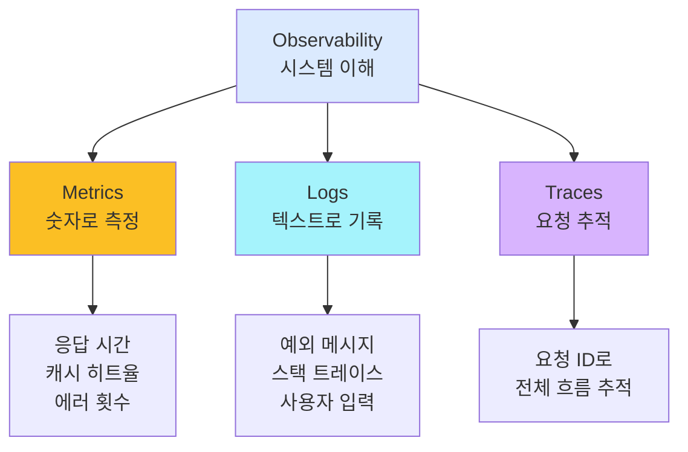
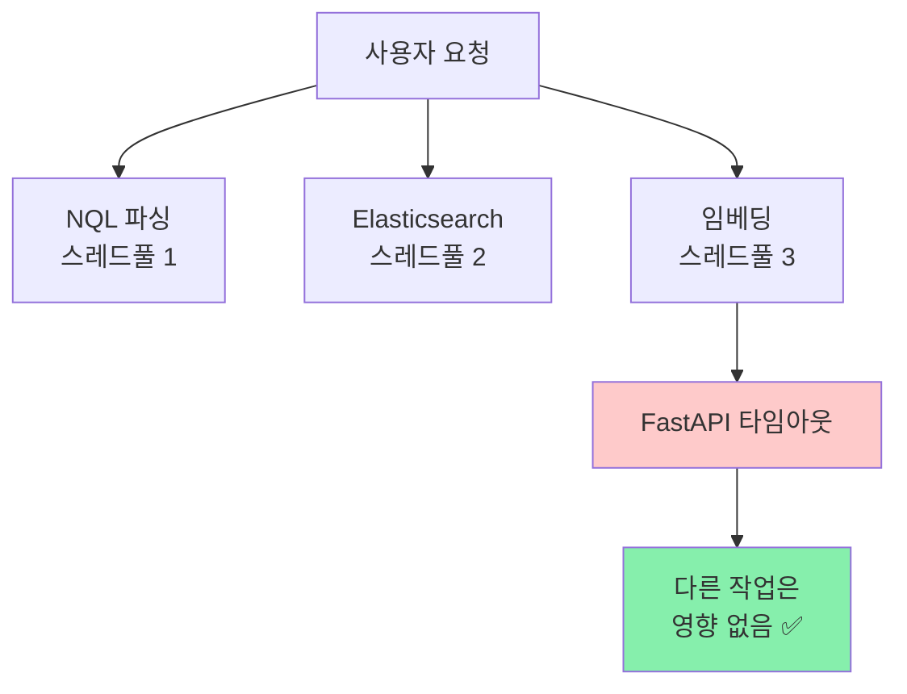

# Phase 1-1: 오류 처리와 모니터링의 이론 - 왜 필요한가?

> **시리즈:** N-QL Intelligence (1/10) | **난이도:** ⭐⭐ | **읽는 시간:** 8분

---

## 소개

뉴스 검색 엔진은 **24/7 실시간으로 동작**해야 합니다.

하지만 현실은 가혹합니다:
- 🔴 Elasticsearch가 다운된다
- 🔴 사용자 입력이 잘못되었다
- 🔴 외부 API가 응답하지 않는다
- 🔴 데이터베이스가 느려진다

**이 모든 상황에서 사용자에게 "500 Internal Server Error"를 보여주면?** 

사용자는 서비스를 신뢰하지 않습니다. 경쟁사로 떠납니다.

---

## Part 1: 오류 처리란 무엇인가?

### 1-1. 오류의 분류

모든 오류가 같지 않습니다:

```
시스템 오류 (Internal Error)
├─ 프로그래밍 오류
│  └─ NullPointerException, ArrayIndexOutOfBoundsException
│
├─ 외부 의존성 오류
│  ├─ Elasticsearch 연결 실패
│  ├─ Kafka 브로커 다운
│  └─ 임베딩 서비스 타임아웃
│
└─ 리소스 오류
   ├─ 메모리 부족
   ├─ 디스크 풀
   └─ 데이터베이스 커넥션 부족

사용자 오류 (Client Error)
├─ 잘못된 입력
│  └─ "keyword('AI') AND sentiment = INVALID"
│
├─ 없는 리소스 요청
│  └─ /api/query/999999
│
└─ 권한 부족
   └─ 다른 사용자의 저장된 검색 접근
```

### 1-2. HTTP 상태 코드의 의미

| 상태 코드 | 의미 | 사용자 책임 | 처리 방법 |
|-----------|------|------------|---------|
| **400** | Bad Request | YES | 입력 재검토 |
| **401** | Unauthorized | YES | 로그인 필요 |
| **403** | Forbidden | YES | 권한 없음 |
| **404** | Not Found | YES | 리소스 없음 |
| **500** | Server Error | NO | 운영팀 호출 |
| **503** | Service Unavailable | NO | 잠시 후 재시도 |

**핵심:** 400번대는 사용자 잘못, 500번대는 서버 잘못

### 1-3. 오류 처리의 3단계


1. **감지 (Detection):** 오류가 발생했는가?
2. **분류 (Classification):** 어떤 종류의 오류인가?
3. **응답 (Response):** 사용자에게 무엇을 말할 것인가?
4. **로깅 (Logging):** 운영팀이 나중에 분석하기 위해 기록
5. **모니터링 (Monitoring):** 패턴을 발견하고 문제 예측

---

## Part 2: 예외 처리 전략

### 2-1. 체크 예외 vs 언체크 예외

**Java의 예외 계층:**

```
Throwable
├─ Exception (체크 예외)
│  ├─ IOException (파일 읽기)
│  ├─ SQLException (DB 쿼리)
│  └─ 사용자 정의: NQLParsingException
│
└─ RuntimeException (언체크 예외)
   ├─ NullPointerException
   ├─ ArrayIndexOutOfBoundsException
   └─ 사용자 정의: SearchException
```

**어떤 것을 써야 하나?**

| 상황 | 예외 타입 | 이유 |
|------|----------|------|
| 사용자 입력 오류 | 체크 (Exception) | 반드시 처리하도록 강제 |
| 외부 API 실패 | 언체크 (RuntimeException) | 복구 불가능 |
| 프로그래밍 오류 | 언체크 (RuntimeException) | 즉시 중단 후 로깅 |

### 2-2. 예외 처리의 패턴

**패턴 1: 복구 가능한 경우 - 재시도**

```
try:
  검색 실행
catch Elasticsearch 연결 실패:
  대기 500ms
  재시도 (최대 3회)
finally:
  로깅
```

**패턴 2: 복구 불가능 - 우아한 기능 저하**

```
try:
  임베딩 벡터 생성
catch API 타임아웃:
  null 반환
finally:
  로깅
  
→ BM25 단독으로 검색 계속 (벡터 없이)
```

**패턴 3: 사용자 입력 오류 - 명확한 메시지**

```
try:
  쿼리 파싱
catch NQL 문법 오류:
  400 Bad Request
  message: "Line 5, Column 12: Unexpected token"
```

---

## Part 3: 모니터링과 관찰성(Observability)

### 3-1. Three Pillars of Observability



### 3-2. 메트릭의 4가지 유형

**RED 방법론** (Request-driven 서비스):

| 메트릭 | 설명 | 예시 |
|--------|------|------|
| **R**ate | 초당 요청 수 | 1000 req/sec |
| **E**rrors | 초당 오류 수 | 5 errors/sec |
| **D**uration | 응답 시간 | P99: 120ms |

**USE 방법론** (Resource-driven 서비스):

| 메트릭 | 설명 | 예시 |
|--------|------|------|
| **U**tilization | 리소스 사용률 | CPU 65%, 메모리 80% |
| **S**aturation | 대기 큐 길이 | 500 requests in queue |
| **E**rrors | 오류 발생률 | Connection refused |

### 3-3. 로깅 vs 메트릭

```
로깅 (Logs)
├─ 목적: 문제 디버깅
├─ 데이터 크기: 크다 (MB/sec)
├─ 보관 기간: 며칠~주
├─ 쿼리: 특정 오류 찾기
└─ 예: "NQL parsing failed: Unexpected token at line 5"

메트릭 (Metrics)
├─ 목적: 패턴 인식
├─ 데이터 크기: 작다 (KB/sec)
├─ 보관 기간: 1년+
├─ 쿼리: 시간대별 트렌드
└─ 예: "parsing_errors_total{hour=14} = 234"
```

---

## Part 4: 설계 원칙

### 4-1. 실패에 대한 가정

#### 원칙 1: 모든 것은 실패할 수 있다

```
Elasticsearch ─┐
               ├─ 모두 동시에 실패할 수 있다
Kafka ────────┤
               ├─ → "나쁜 일"로 대비해야 함
FastAPI ──────┘

이를 "Fail Open" 설계라고 함
```

#### 원칙 2: 부분 실패는 전체 실패보다 낫다

```
검색 엔진의 5가지 기능
1. NQL 파싱         ✅
2. Elasticsearch    ❌ (다운)
3. 임베딩 생성      ✅
4. RRF 점수 계산    ✅
5. 결과 반환        ✅

→ BM25만으로 검색 결과 반환 (부분 기능)
→ 사용자는 "검색 결과가 정확하지 않을 수 있음"을 이해
```

#### 원칙 3: 오류 메시지는 "What" + "Why" + "How"

```
❌ 나쁜 예:
"500 Internal Server Error"

✅ 좋은 예:
"Elasticsearch search failed (What)
because the service is temporarily unavailable (Why).
Please try again in a few moments. (How)"
```

### 4-2. Bulkhead Pattern



**개념:** 각 기능별로 독립적인 리소스 할당
- Elasticsearch 느림 → 그 스레드풀만 영향
- 다른 검색은 정상 작동

---

## Part 5: 이론 정리

### 체크리스트: 좋은 오류 처리란?

- [ ] **감지**: 모든 오류를 잡아낼 수 있는가?
- [ ] **분류**: 사용자 오류 vs 서버 오류를 구분하는가?
- [ ] **응답**: 사용자가 다음 단계를 알 수 있는가?
- [ ] **로깅**: 운영팀이 재현할 수 있는가?
- [ ] **모니터링**: 문제를 사전에 알 수 있는가?
- [ ] **복구**: 부분 기능이라도 계속 서비스하는가?

---

## 다음 편 예고

**Phase 1-2: 실제로 구현해보기**

이론을 바탕으로 다음을 구현합니다:
- 📌 GlobalExceptionHandler로 모든 예외를 잡기
- 📌 ANTLR4 파싱 오류 처리
- 📌 Elasticsearch 재시도 로직 (Exponential Backoff)
- 📌 Graceful Degradation (임베딩 실패 시)
- 📌 Prometheus 메트릭 수집

---

## 참고 자료

- [Release It!](https://pragprog.com/titles/mnee2/release-it-second-edition/) - Michael T. Nygard
- [Designing Data-Intensive Applications](https://dataintensive.net/) - Martin Kleppmann
- [The Art of Monitoring](https://artofmonitoring.com/) - James Turnbull
- [Google SRE Book - Monitoring Distributed Systems](https://sre.google/sre-book/monitoring-distributed-systems/)

---

**핵심 메시지**

> 오류 처리는 코딩이 아니라 **철학**입니다.
> 
> "사용자에게 어떤 경험을 주고 싶은가?"를 먼저 정의하고,
> 그에 맞는 기술을 선택하세요.

---

**다음 편을 기대하세요!** 🚀

