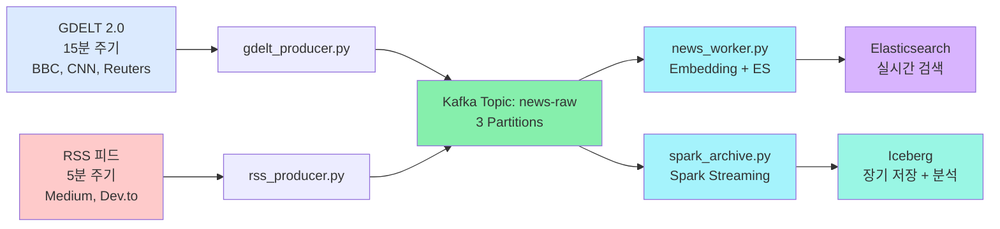
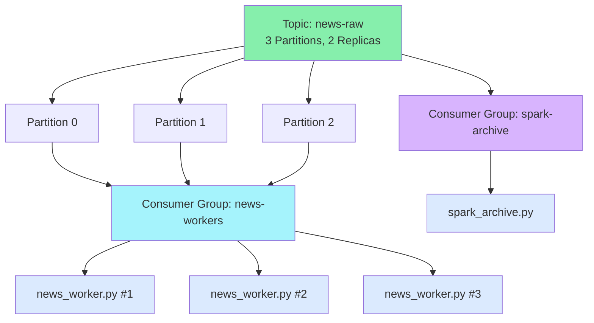

# Phase 3: 데이터 파이프라인 최적화 - 실시간 뉴스 수집부터 검색까지

> **시리즈:** N-QL Intelligence 블로그 | **난이도:** ⭐⭐⭐ | **읽는 시간:** 14분

---

## 소개

**Phase 1-2**에서는 쿼리 처리를 완벽하게 했습니다. 하지만 쿼리를 처리할 데이터가 없으면 소용없습니다.

**Phase 3**은 엔진의 혈관입니다:
- 🌍 뉴스는 어디서 수집하나? (GDELT 2.0 vs RSS)
- 📡 어떻게 전달하나? (Kafka)
- 🔍 어떻게 검색 가능하게 만드나? (Elasticsearch)
- 📦 장기 보관은? (Iceberg)

---

## 시스템 아키텍처 한눈에



---

## Part 1: 뉴스 소스 전략 - GDELT vs RSS

### 1-1. GDELT 2.0란?

**Global Database of Events, Language, and Tone** — 전 세계 뉴스 이벤트 데이터베이스

```python
# GDELT 2.0의 특징
특징                  장점                      단점
──────────────────────────────────────────────────────────
실시간 (15분)         최신 뉴스 빠른 반영       API 속도 느림
전 세계 커버리지      1000+ 뉴스 소스          정제가 필요
감정 분석 포함        이미 Sentiment 계산됨    정확도 조금 낮음
이벤트 구조화         필터링 용이              가공이 필요
```

### 1-2. RSS 피드란?

사용자가 선택한 특정 매체의 뉴스만 받기

```python
# RSS의 특징
특징                  장점                      단점
──────────────────────────────────────────────────────────
주기 (1-60분)         설정에 따라 유연          GDELT보다 느림
선택적 소스           품질 높은 뉴스만         커버리지 제한
원본 기사            신뢰도 높음              직접 관리 필요
구조화되지 않음       있는 그대로              자체 처리 필요
```

### 1-3. 하이브리드 전략 (권장)

```python
# pipeline/config.py
GDELT_ENABLED = True        # GDELT: 광범위한 커버리지 (기본)
GDELT_INTERVAL = 15         # 15분 주기

RSS_ENABLED = True          # RSS: 고품질 소스 추가
RSS_INTERVAL = 5            # 5분 주기
RSS_SOURCES = [
    "https://www.bbci.co.uk/news/?format=xml",
    "https://feeds.reuters.com/reuters/technology",
    "https://www.cnbc.com/id/100003114/device/rss/rss.html",
]

# 결과: GDELT(양) + RSS(질) = 최고의 조합
```

---

## Part 2: Kafka 메시지 브로커

### 2-1. 토픽 구성



### 2-2. 메시지 포맷

```json
{
  "id": "gdelt_20260423_12345",
  "title": "OpenAI Releases GPT-5",
  "url": "https://...",
  "source": "Reuters",
  "publishedAt": "2026-04-23T14:30:00Z",
  "content": "In a landmark announcement...",
  "sentiment": 0.85,
  "category": "TECHNOLOGY",
  "country": "US",
  "timestamp": 1713880200000
}
```

### 2-3. Producer 구현 (GDELT)

```python
# pipeline/gdelt_producer.py
from kafka import KafkaProducer
import requests
import json
from datetime import datetime

producer = KafkaProducer(
    bootstrap_servers=['localhost:9092'],
    value_serializer=lambda v: json.dumps(v).encode('utf-8')
)

def fetch_gdelt_news():
    """GDELT 2.0 API에서 최신 뉴스 가져오기"""
    url = "https://api.gdeltproject.org/api/v2/search/tv"
    params = {
        "query": "program:news",  # 모든 뉴스 프로그램
        "mode": "artlist",        # 기사 목록
        "format": "json",
        "maxrecords": 100
    }
    
    response = requests.get(url, params=params)
    articles = response.json()
    
    return articles

def process_and_publish(articles):
    """뉴스 처리 및 Kafka로 발행"""
    for article in articles:
        try:
            message = {
                "id": f"gdelt_{article['seqnum']}",
                "title": article['title'],
                "url": article['url'],
                "source": article['source'],
                "publishedAt": article['dateadded'],
                "content": article['summary'],
                "sentiment": article.get('tone', 0),  # 감정점수 (-100~100)
                "category": categorize(article['gcam']),
                "country": extract_country(article['locations']),
                "timestamp": int(datetime.now().timestamp() * 1000)
            }
            
            producer.send(
                'news-raw',
                value=message,
                partition=hash(message['source']) % 3  # 균등 분배
            )
            
        except Exception as e:
            logger.error(f"Failed to process article: {e}")

def categorize(gcam_codes):
    """GDELT 카테고리를 표준 카테고리로 변환"""
    category_map = {
        "030": "CONFLICT",
        "040": "DIPLOMACY",
        "060": "GOVERNMENT",
        "070": "SCIENCE_TECH",
        ...
    }
    return category_map.get(gcam_codes[0], "OTHER")

if __name__ == "__main__":
    while True:
        articles = fetch_gdelt_news()
        process_and_publish(articles)
        time.sleep(900)  # 15분
```

### 2-4. Consumer 구현 (news_worker.py)

```python
# pipeline/news_worker.py
from kafka import KafkaConsumer
from elasticsearch import Elasticsearch
import json

es = Elasticsearch(['http://localhost:9200'])
embedding_service_url = "http://localhost:8000/embed/single"

consumer = KafkaConsumer(
    'news-raw',
    bootstrap_servers=['localhost:9092'],
    group_id='news-workers',
    enable_auto_commit=False,  # 수동 커밋 (at-least-once)
    auto_offset_reset='earliest',
    value_deserializer=lambda m: json.loads(m.decode('utf-8'))
)

def embed_text(text):
    """FastAPI 임베딩 서비스 호출"""
    try:
        response = requests.post(
            f"{embedding_service_url}/embed/single",
            json={"text": text},
            timeout=5
        )
        return response.json()['embedding']
    except:
        return None  # Graceful degradation

def process_message(message):
    """메시지 처리 및 Elasticsearch 인덱싱"""
    
    # 1. 제목 + 내용 결합해서 벡터 생성
    text_to_embed = f"{message['title']} {message['content']}"
    embedding = embed_text(text_to_embed)
    
    # 2. ES 문서 구성
    doc = {
        "id": message['id'],
        "title": message['title'],
        "url": message['url'],
        "source": message['source'],
        "publishedAt": message['publishedAt'],
        "content": message['content'],
        "sentiment": message['sentiment'],
        "category": message['category'],
        "country": message['country'],
        "content_vector": embedding  # 384차원 벡터
    }
    
    return doc

def main():
    bulk_docs = []
    
    for message in consumer:
        try:
            doc = process_message(message.value)
            bulk_docs.append(doc)
            
            # 배치 단위로 인덱싱 (100개씩)
            if len(bulk_docs) >= 100:
                es.bulk(index='news', body=bulk_docs)
                bulk_docs = []
                
                # ES 저장 성공 후 커밋
                consumer.commit()
                print(f"✓ Indexed 100 documents")
                
        except Exception as e:
            logger.error(f"Failed to process message: {e}")
            # 실패시 커밋하지 않음 → 재처리

if __name__ == "__main__":
    main()
```

---

## Part 3: Elasticsearch 인덱스 최적화

### 3-1. 인덱스 매핑

```python
# scripts/setup_es_index.py
mapping = {
    "settings": {
        "number_of_shards": 3,      # 병렬 검색
        "number_of_replicas": 1,    # 고가용성
        "refresh_interval": "30s",  # 30초마다 새로고침
        "analysis": {
            "analyzer": {
                "custom_analyzer": {
                    "type": "standard",
                    "stopwords": "_english_"
                }
            }
        }
    },
    "mappings": {
        "properties": {
            "id": {
                "type": "keyword"
            },
            "title": {
                "type": "text",
                "analyzer": "custom_analyzer",
                "fields": {
                    "raw": {"type": "keyword"}
                }
            },
            "content": {
                "type": "text",
                "analyzer": "custom_analyzer"
            },
            "content_vector": {
                "type": "dense_vector",
                "dims": 384,
                "index": True,
                "similarity": "cosine"
            },
            "source": {
                "type": "keyword"
            },
            "sentiment": {
                "type": "float"
            },
            "publishedAt": {
                "type": "date"
            },
            "category": {
                "type": "keyword"
            },
            "country": {
                "type": "keyword"
            }
        }
    }
}

es.indices.create(index='news', body=mapping)
```

### 3-2. 성능 튜닝 체크리스트

| 설정 | 값 | 목적 |
|------|-----|------|
| `number_of_shards` | 3 | 병렬 검색 (3개 파티션과 일치) |
| `number_of_replicas` | 1 | 고가용성 + 읽기 성능 |
| `refresh_interval` | 30s | 근실시간 + 인덱싱 성능 균형 |
| `dense_vector.dims` | 384 | all-MiniLM-L6-v2 모델 크기 |
| `dense_vector.similarity` | cosine | 텍스트 의미 유사도 측정 |

---

## Part 4: Iceberg로 장기 저장

### 4-1. Iceberg란?

Apache Iceberg는 **대규모 데이터 레이크**를 위한 테이블 형식입니다.

```python
# 특징
특징                  효과
───────────────────────────────────────
Time Travel          특정 시점의 데이터 조회 가능
Schema Evolution     스키마 변경 구조화
Partitioning        파티션으로 쿼리 최적화
Snapshot             버전 관리
```

### 4-2. Spark Streaming → Iceberg

```python
# pipeline/spark_archive.py
from pyspark.sql import SparkSession
from pyspark.sql.types import StructType, StructField, StringType, DoubleType, LongType, ArrayType

spark = SparkSession.builder \
    .appName("NewsArchive") \
    .config("spark.jars.packages", "org.apache.iceberg:iceberg-spark-runtime-3.x:latest") \
    .getOrCreate()

# 스키마 정의
schema = StructType([
    StructField("id", StringType()),
    StructField("title", StringType()),
    StructField("url", StringType()),
    StructField("source", StringType()),
    StructField("publishedAt", StringType()),
    StructField("content", StringType()),
    StructField("sentiment", DoubleType()),
    StructField("category", StringType()),
    StructField("country", StringType()),
    StructField("content_vector", ArrayType(DoubleType())),
    StructField("ingestedAt", LongType()),
])

# Kafka에서 실시간으로 읽기
df = spark \
    .readStream \
    .format("kafka") \
    .option("kafka.bootstrap.servers", "localhost:9092") \
    .option("subscribe", "news-raw") \
    .load() \
    .select(from_json(col("value").cast("string"), schema).alias("data")) \
    .select("data.*") \
    .withColumn("date", from_unixtime(col("ingestedAt") / 1000, "yyyy-MM-dd"))

# Iceberg 테이블로 저장 (파티션: 날짜별)
query = df \
    .writeStream \
    .format("iceberg") \
    .mode("append") \
    .option("path", "s3://newsquery-lake/news") \
    .option("checkpointLocation", "/tmp/news_checkpoint") \
    .partitionedBy("date") \
    .start()

query.awaitTermination()
```

### 4-3. Iceberg 조회

```python
# scripts/query_iceberg.py
# 최근 1000개 문서 조회
df = spark.sql("SELECT * FROM iceberg.news ORDER BY publishedAt DESC LIMIT 1000")
df.show()

# 특정 날짜 범위
spark.sql("""
    SELECT title, sentiment, publishedAt
    FROM iceberg.news
    WHERE date BETWEEN '2026-04-20' AND '2026-04-23'
    AND category = 'TECHNOLOGY'
    ORDER BY sentiment DESC
""").show()

# 시간 여행 (2시간 전 스냅샷)
spark.sql("""
    SELECT * FROM iceberg.news
    TIMESTAMP AS OF '2026-04-23 12:00:00'
""").show()
```

---

## Part 5: 엔드-투-엔드 데이터 흐름

### 5-1. 메시지 추적 (예시)

```
시간: 2026-04-23 14:30:00

1️⃣ GDELT API에서 기사 발견
   Title: "OpenAI Releases GPT-5"
   
2️⃣ gdelt_producer.py 처리
   JSON으로 변환 → Partition 1로 발행
   
3️⃣ Kafka Topic: news-raw
   [{"id": "gdelt_...", "title": "OpenAI...", ...}]
   
4️⃣ news_worker.py #2 (Partition 1 담당)
   - 제목 + 내용 임베딩
   - Elasticsearch 인덱싱
   - Commit
   
5️⃣ Elasticsearch: news index
   GET /news/_search?q=openai
   → 0.3초 내 검색 가능 ✓
   
6️⃣ spark_archive.py
   - Spark Streaming으로 수신
   - Iceberg 테이블에 저장
   - date="2026-04-23" 파티션
   
7️⃣ Iceberg: news table
   SELECT * FROM news WHERE date='2026-04-23'
   → 3년 데이터 분석 가능 ✓
```

### 5-2. 성능 메트릭

| 단계 | 소요 시간 | 처리량 |
|------|----------|--------|
| GDELT 수집 | 1-2초 | 100 articles/15min |
| RSS 수집 | 0.5-1초 | 20 articles/5min |
| Kafka 전송 | <10ms | 1000 msgs/sec |
| ES 임베딩 | 100-200ms | 10 articles/sec |
| ES 인덱싱 | 50-100ms (배치) | 100 articles/30s |
| Iceberg 저장 | 1-2초 (배치) | 자동 파티션 |

---

## Phase 3 실전 셋업

### 실행 순서

```bash
# 1. 인프라 시작
docker-compose up -d
docker-compose ps

# 2. Elasticsearch 준비
python scripts/update_es_mapping.py

# 3. 임베딩 서비스
python pipeline/embedding_service.py &

# 4. 뉴스 워커 (Consumer)
python pipeline/news_worker.py &

# 5. 뉴스 수집 시작
python pipeline/gdelt_producer.py &
python pipeline/rss_producer.py &

# 모니터링
curl http://localhost:9200/_cat/indices
curl http://localhost:9200/news/_count

# Iceberg 설정 (선택)
python scripts/setup_iceberg.py
```

---

## Phase 3 성과 요약

| 항목 | 효과 |
|------|------|
| GDELT + RSS | 광범위 + 고품질 뉴스 수집 |
| Kafka | 안정적 메시지 전달 (at-least-once) |
| news_worker.py | 실시간 임베딩 + 인덱싱 |
| Elasticsearch | 검색 가능한 인덱스 (30초 신선도) |
| Iceberg | 3년+ 장기 데이터 저장 + 분석 |

---

## 핵심 배운점

### 1️⃣ 데이터 품질이 검색 품질을 결정
- GDELT로 양을 확보
- RSS로 질을 확보

### 2️⃣ Kafka는 버퍼 역할
- 수집과 처리의 속도 차이 해결
- 장애 격리

### 3️⃣ Elasticsearch는 실시간, Iceberg는 분석용
- 목적이 다르면 도구도 다름

---

## 다음 편 예고

**Phase 4: 성능 최적화 - 30ms를 20ms로**

검색 속도를 두 배 가깝게 단축하는 방법:
- 📌 Redis 2계층 캐싱 (NQL + 벡터)
- 📌 Elasticsearch 샤드 최적화
- 📌 벡터 검색 k값 동적 조정
- 📌 JMH 마이크로 벤치마크

---

**다음 편을 기대하세요!** 🚀

