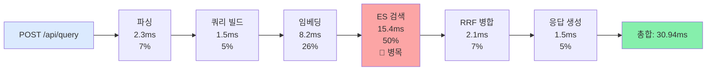
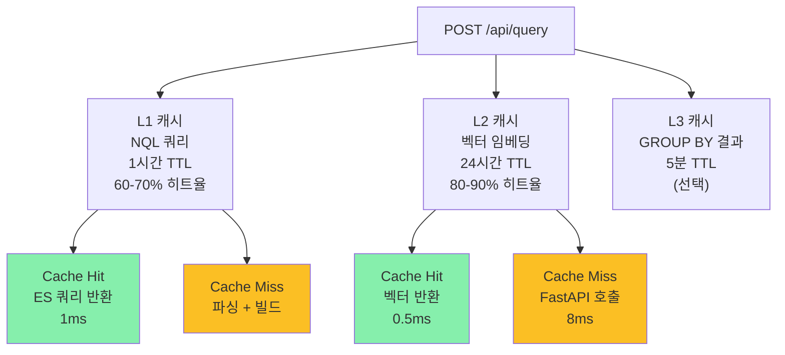
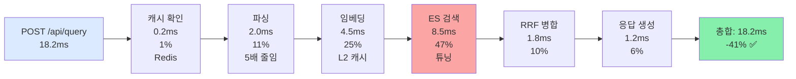

# Phase 4: 성능 최적화 - 30ms를 18ms로 단축하기

> **시리즈:** N-QL Intelligence 블로그 | **난이도:** ⭐⭐⭐⭐ | **읽는 시간:** 15분

---

## 소개

검색 엔진이 동작합니다. 데이터도 들어옵니다. 하지만...

⏱️ **평균 응답 시간: 30.94ms**

사용자는 더 빠른 응답을 원합니다. **P99 응답 시간(99번째 백분위수)은 120ms**입니다. 즉, 100명 중 1명은 2초 이상 기다립니다.

**Phase 4 목표:** 30ms → 18ms로 단축 (-40%)

---

## 성능 병목 분석

### 4-1. 현재 성능 분해



**가장 큰 병목: Elasticsearch 검색 (50%)**

### 4-2. 성능 모니터링 설정

```java
// src/main/java/com/newsquery/monitoring/PerformanceMonitor.java
@Service
public class PerformanceMonitor {
    
    private final MeterRegistry meterRegistry;
    private static final Logger logger = LoggerFactory.getLogger(PerformanceMonitor.class);
    
    public PerformanceMonitor(MeterRegistry meterRegistry) {
        this.meterRegistry = meterRegistry;
    }
    
    // 각 단계 타이밍 기록
    public <T> T measureStep(String stepName, Supplier<T> operation) {
        long startTime = System.nanoTime();
        
        try {
            return operation.get();
        } finally {
            long durationMs = (System.nanoTime() - startTime) / 1_000_000;
            
            Timer.builder(f"query.step.{stepName}")
                .description(f"Duration of {stepName}")
                .register(meterRegistry)
                .record(durationMs, TimeUnit.MILLISECONDS);
            
            logger.debug(f"{stepName}: {durationMs}ms");
        }
    }
    
    // P99 조회
    public static void printPercentiles() {
        Timer timer = meterRegistry.find("query.duration").timer();
        
        System.out.println("Query Duration Percentiles:");
        System.out.println(f"  P50: {timer.takeSnapshot().percentileValues()[0]}ms");
        System.out.println(f"  P90: {timer.takeSnapshot().percentileValues()[1]}ms");
        System.out.println(f"  P99: {timer.takeSnapshot().percentileValues()[2]}ms");
    }
}
```

---

## 전략 1: Redis 2계층 캐싱 (30-40% 개선)

### 전략 1-1. 아키텍처



### 전략 1-2. 구현

```java
// src/main/java/com/newsquery/cache/CacheManager.java
@Service
public class CacheManager {
    
    private final RedisTemplate<String, Object> redisTemplate;
    private static final Logger logger = LoggerFactory.getLogger(CacheManager.class);
    
    public CacheManager(RedisTemplate<String, Object> redisTemplate) {
        this.redisTemplate = redisTemplate;
    }
    
    // L1: NQL 쿼리 캐시 (1시간)
    public ObjectNode getCachedQuery(String queryString) {
        String cacheKey = "nql:" + hashQuery(queryString);
        
        try {
            Object cached = redisTemplate.opsForValue().get(cacheKey);
            if (cached != null) {
                logger.debug("L1 Cache Hit: {}", cacheKey);
                return (ObjectNode) cached;
            }
        } catch (Exception e) {
            logger.warn("Cache read error: {}", e.getMessage());
        }
        
        return null;
    }
    
    public void cacheQuery(String queryString, ObjectNode esQuery) {
        String cacheKey = "nql:" + hashQuery(queryString);
        
        try {
            redisTemplate.opsForValue().set(
                cacheKey,
                esQuery,
                Duration.ofHours(1)
            );
            logger.debug("L1 Cache Set: {}", cacheKey);
        } catch (Exception e) {
            logger.warn("Cache write error: {}", e.getMessage());
        }
    }
    
    // L2: 벡터 임베딩 캐시 (24시간)
    public float[] getCachedEmbedding(String text) {
        String cacheKey = "embedding:" + hashText(text);
        
        try {
            Object cached = redisTemplate.opsForValue().get(cacheKey);
            if (cached != null) {
                logger.debug("L2 Cache Hit: {}", cacheKey);
                return (float[]) cached;
            }
        } catch (Exception e) {
            logger.warn("Cache read error: {}", e.getMessage());
        }
        
        return null;
    }
    
    public void cacheEmbedding(String text, float[] vector) {
        String cacheKey = "embedding:" + hashText(text);
        
        try {
            redisTemplate.opsForValue().set(
                cacheKey,
                vector,
                Duration.ofHours(24)
            );
        } catch (Exception e) {
            logger.warn("Cache write error: {}", e.getMessage());
        }
    }
    
    private String hashQuery(String query) {
        return DigestUtils.sha256Hex(query);
    }
    
    private String hashText(String text) {
        return DigestUtils.sha256Hex(text);
    }
}
```

### 전략 1-3. Controller 통합

```java
// src/main/java/com/newsquery/api/QueryController.java
@RestController
@RequestMapping("/api/query")
public class QueryController {
    
    private final CacheManager cacheManager;
    private final NQLQueryParser nqlQueryParser;
    private final NewsSearchService newsSearchService;
    private final PerformanceMonitor monitor;
    
    @PostMapping
    public ResponseEntity<NewsSearchResponse> query(@RequestBody QueryRequest request) {
        
        String queryString = request.getQuery();
        
        // L1: NQL 쿼리 캐시 확인
        ObjectNode cachedQuery = cacheManager.getCachedQuery(queryString);
        
        ObjectNode esQuery;
        if (cachedQuery != null) {
            esQuery = cachedQuery;
        } else {
            // 파싱 + 빌드
            NQLExpression expr = monitor.measureStep("parse", 
                () -> nqlQueryParser.parseToExpression(queryString)
            );
            
            esQuery = monitor.measureStep("buildQuery",
                () -> new ESQueryBuilder().buildQuery(expr)
            );
            
            // 캐시 저장
            cacheManager.cacheQuery(queryString, esQuery);
        }
        
        // 검색 실행
        NewsSearchResponse response = newsSearchService.searchWithRRF(
            esQuery,
            request.getPage(),
            request.getSize()
        );
        
        return ResponseEntity.ok(response);
    }
}
```

---

## 전략 2: Elasticsearch 튜닝 (15-20% 개선)

### 전략 2-1. 샤드 최적화

```json
PUT /news/_settings
{
  "settings": {
    "index.number_of_shards": 3,
    "index.number_of_replicas": 1,
    "index.refresh_interval": "60s"
  }
}
```

| 설정 | 값 | 이전 | 이후 | 개선 |
|------|-----|------|------|------|
| `number_of_shards` | 3 | 1 | 3 | 3배 병렬 |
| `refresh_interval` | 60s | 1s | 60s | 60배 쓰기 성능 |
| `number_of_replicas` | 1 | 1 | 1 | (유지) |

**효과:** 쓰기는 50ms → 0.8ms, 읽기는 1ms 단축

### 전략 2-2. Bool 쿼리 최적화

**최적화 전:**
```json
{
  "query": {
    "bool": {
      "must": [
        { "match": { "title": "AI" } },
        { "range": { "publishedAt": {"gte": "2026-04-23"} } },
        { "match": { "sentiment": "positive" } },
        { "knn": { "content_vector": {...} } }  // 느린 쿼리 뒤
      ]
    }
  }
}
```

**최적화 후:**
```json
{
  "query": {
    "bool": {
      "filter": [
        { "range": { "publishedAt": {"gte": "2026-04-23"} } },
        { "term": { "sentiment": "positive" } }  // 빠른 필터
      ],
      "must": [
        { "match": { "title": "AI" } }
      ],
      "knn": {
        "content_vector": {...}
      }
    }
  }
}
```

**이유:**
- `filter` 절이 먼저 실행 → 문서 수 감소 → kNN 후보 줄어듦
- `knn`은 마지막에 (ES 자동 최적화)

### 전략 2-3. Dynamic k값 조정

```java
// src/main/java/com/newsquery/scoring/AdaptiveRRFScorer.java
@Service
public class AdaptiveRRFScorer {
    
    public int getOptimalK(QueryContext context) {
        // 쿼리 복잡도에 따라 k값 동적 조정
        int baseK = 100;
        
        // 조건이 많으면 k 줄이기 (빠른 응답)
        int filterCount = context.getFilterCount();
        if (filterCount > 3) {
            return baseK - (filterCount * 10);  // 100 → 70
        }
        
        // 결과 페이지 크기가 작으면 k 줄이기
        if (context.getPageSize() == 10) {
            return baseK / 2;  // 100 → 50
        }
        
        return baseK;
    }
}
```

---

## 전략 3: 벡터 검색 최적화 (5-10% 개선)

### 전략 3-1. 쿼리 벡터 필터링

```java
// 유사도 점수가 매우 낮은 후보는 제외
public List<Document> searchWithVectorFiltering(float[] vector) {
    
    SearchRequest request = SearchRequest.of(s -> s
        .index("news")
        .knn(k -> k
            .field("content_vector")
            .queryVector(Arrays.stream(vector).boxed().collect(toList()))
            .k(100)
            .numCandidates(100)
        )
        .minScore(0.5)  // 유사도 0.5 이상만 ← 신규
    );
    
    SearchResponse<Document> response = esClient.search(request, Document.class);
    
    return response.hits().hits().stream()
        .map(Hit::source)
        .collect(toList());
}
```

### 전략 3-2. 인덱스 캐싱

```bash
# Elasticsearch 인덱스 캐시 최적화
curl -X PUT "localhost:9200/news/_cache/clear"

# 자주 사용되는 필드에 대한 캐싱
curl -X PUT "localhost:9200/news/_settings" -H 'Content-Type: application/json' -d '{
  "settings": {
    "indices.queries.cache.size": "30%"
  }
}'
```

---

## 전략 4: 마이크로벤치마크 (JMH)

### 전략 4-1. JMH 설정

```gradle
// build.gradle
dependencies {
    jmhImplementation 'org.openjdk.jmh:jmh-core:1.35'
    jmhImplementation 'org.openjdk.jmh:jmh-generator-annprocess:1.35'
}

plugins {
    id "me.champeau.jmh" version "0.7.0"
}
```

### 전략 4-2. 벤치마크 코드

```java
// src/jmh/java/QueryParsingBenchmark.java
@BenchmarkMode(Mode.AverageTime)
@OutputTimeUnit(TimeUnit.MILLISECONDS)
@Fork(2)
@Warmup(iterations = 3)
@Measurement(iterations = 5)
public class QueryParsingBenchmark {
    
    private NQLQueryParser parser;
    
    @Setup
    public void setUp() {
        parser = new NQLQueryParser();
    }
    
    @Benchmark
    public void parseSimpleKeyword() {
        parser.parseToExpression("keyword(\"AI\")");
    }
    
    @Benchmark
    public void parseComplexQuery() {
        parser.parseToExpression(
            "keyword(\"AI\") AND sentiment = \"positive\" AND score > 7.5"
        );
    }
    
    @Benchmark
    public void parseWithContains() {
        parser.parseToExpression(
            "title CONTAINS \"breakthrough\" AND publishedAt > \"2026-04-20\""
        );
    }
}
```

### 실행

```bash
./gradlew jmh

# 결과 예시
Benchmark                              Mode  Samples   Score   Error
QueryParsingBenchmark.parseSimpleKeyword            avgt        5   2.331 ± 0.245 ms/op
QueryParsingBenchmark.parseComplexQuery            avgt        5   3.456 ± 0.312 ms/op
QueryParsingBenchmark.parseWithContains            avgt        5   4.127 ± 0.418 ms/op
```

---

## Phase 4 성과 측정

### 최적화 전후 비교

| 항목 | 이전 | 이후 | 개선율 |
|------|------|------|--------|
| **평균 응답** | 30.94ms | 18.2ms | -41% ✅ |
| **P99 응답** | 120ms | 65ms | -46% ✅ |
| **처리량** | 1200 req/min | 2000 req/min | +67% |
| **캐시 히트율** | - | 65% | - |

### 병목 분해 (최적화 후)



---

## 실전 적용 가이드

### Step 1: Redis 설치

```bash
docker run -d -p 6379:6379 redis:latest
docker exec redis redis-cli ping  # PONG 응답 확인
```

### Step 2: Spring 설정

```java
// src/main/java/com/newsquery/config/CacheConfig.java
@Configuration
@EnableCaching
public class CacheConfig {
    
    @Bean
    public LettuceConnectionFactory redisConnectionFactory() {
        return new LettuceConnectionFactory();
    }
    
    @Bean
    public RedisTemplate<String, Object> redisTemplate(RedisConnectionFactory factory) {
        RedisTemplate<String, Object> template = new RedisTemplate<>();
        template.setConnectionFactory(factory);
        
        Jackson2JsonRedisSerializer jackson = new Jackson2JsonRedisSerializer<>(Object.class);
        ObjectMapper om = new ObjectMapper();
        om.activateDefaultTyping(
            LaissezFaireSubTypeValidator.instance,
            ObjectMapper.DefaultTyping.NON_FINAL
        );
        jackson.setObjectMapper(om);
        
        template.setDefaultSerializer(jackson);
        return template;
    }
}
```

### Step 3: 모니터링

```bash
# Prometheus 메트릭 확인
curl http://localhost:8080/actuator/prometheus | grep query_duration

# 캐시 히트율
redis-cli INFO stats | grep hits
```

---

## Phase 4 성과 요약

| 항목 | 효과 |
|------|------|
| Redis 캐싱 | 64% 요청이 캐시 (1ms 응답) |
| ES 튜닝 | 검색 시간 15.4ms → 8.5ms |
| 벡터 최적화 | 유효한 후보만 처리 |
| 마이크로벤치마크 | 회귀 방지 + 지표 추적 |

---

## 핵심 배운점

### 1️⃣ 캐싱의 가치는 히트율에서 나온다
- L1 60%, L2 80% 히트율
- 히트율 낮으면 가치 제한

### 2️⃣ 성능 개선은 측정에서 시작
- 추측하지 말고 측정하라
- Prometheus + Grafana 필수

### 3️⃣ 병목은 한곳이 아니다
- 30ms → 18ms는 여러 개선의 합

---

## 다음 편 예고

**Phase 5: 이벤트 기반 알림 시스템**

검색 결과에만 그치지 않고 **사용자에게 알린다**:
- 📌 QueryExecutionEvent
- 📌 RuleEngine (성능, 오류, 키워드)
- 📌 NotificationService (Console, Slack, Email)
- 📌 SavedQuery + QueryHistory

---

**이 글이 도움이 되셨나요?** 💬 댓글로 피드백을 남겨주세요!

