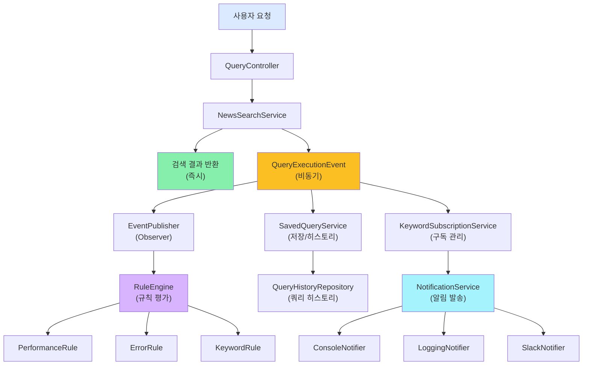
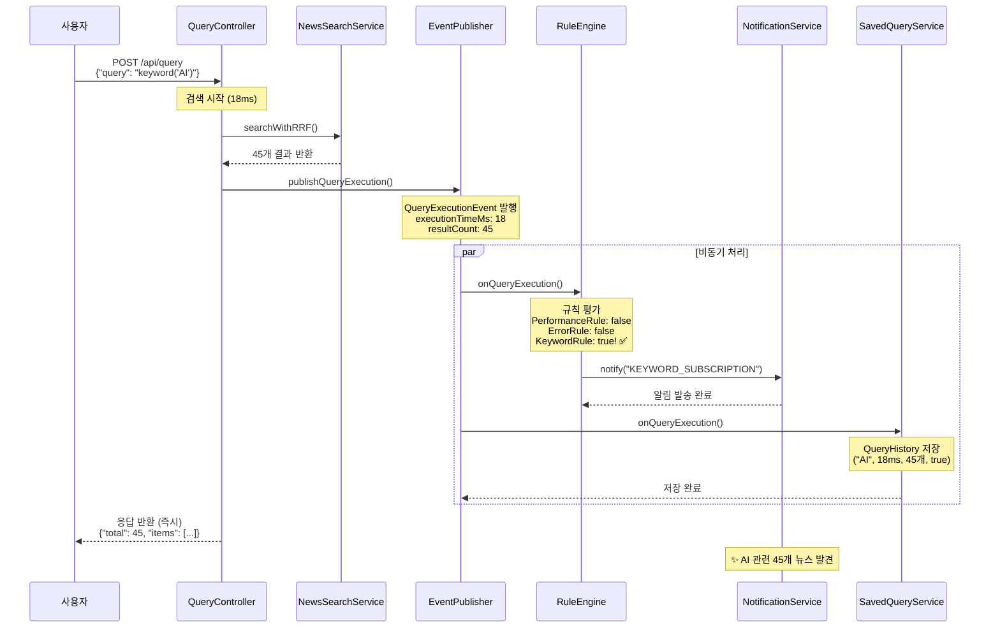
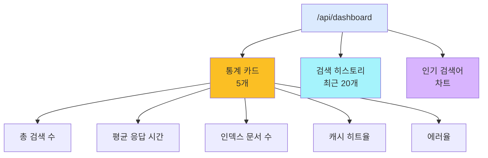
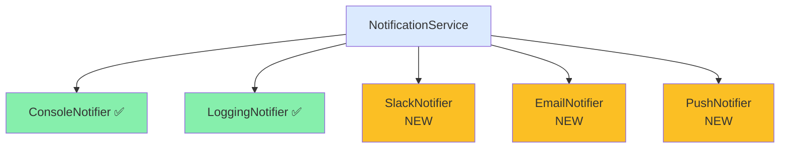

# Phase 5: 이벤트 기반 아키텍처로 알림 시스템 구축

> **시리즈:** N-QL Intelligence 블로그 | **난이도:** ⭐⭐⭐⭐⭐ | **읽는 시간:** 18분

---

## 소개

**Phase 1-4**까지 완벽한 검색 엔진을 만들었습니다. 하지만 검색만으로는 부족합니다.

사용자의 진정한 니즈:
- 📲 "관심 있는 키워드의 뉴스가 나오면 알려줘"
- ⚠️ "검색이 느려지면 알려줘"
- 📌 "지난번 검색을 다시 하고 싶어"
- 📊 "내 검색 통계를 보여줘"

**Phase 5**는 **이벤트 기반 아키텍처**로 이 모든 요구를 해결합니다.

---

## 아키텍처 개요



---

## Part 1: 핵심 아이디어 - Observer 패턴

### 1-1. 이벤트란?

쿼리 실행이 끝났을 때 발생하는 "사건"입니다:

```java
// QueryExecutionEvent.java
public record QueryExecutionEvent(
    String queryId,
    String userId,
    String queryString,
    long executionTimeMs,      // 응답 시간
    int resultCount,           // 검색 결과 수
    boolean success,           // 성공 여부
    String errorMessage,       // 오류 메시지 (null이면 성공)
    long timestamp
) {}
```

### 1-2. Observer 패턴의 핵심

```
이벤트 발행자 (Publisher)
     ↓
   이벤트 (Event)
     ↓
여러 구독자 (Subscribers)
     ├─ SavedQueryService: "히스토리에 저장하자"
     ├─ RuleEngine: "규칙에 맞는지 확인하자"
     └─ NotificationService: "알림을 보내자"
```

**특징:**
- 🎯 느슨한 결합: Publisher는 누가 구독하는지 모름
- 🔄 비동기 처리: 블로킹 없이 병렬 실행
- 🛡️ 장애 격리: 한 구독자 실패 → 다른 구독자 정상

---

## Part 2: 이벤트 발행 시스템

### 2-1. EventPublisher (발행자)

```java
// src/main/java/com/newsquery/event/EventPublisher.java
@Service
public class EventPublisher {
    
    private static final Logger logger = LoggerFactory.getLogger(EventPublisher.class);
    
    // 모든 리스너를 관리
    private final List<QueryExecutionListener> listeners = new CopyOnWriteArrayList<>();
    
    // 리스너 등록
    public void subscribe(QueryExecutionListener listener) {
        listeners.add(listener);
        logger.info("Listener registered: {}", listener.getClass().getSimpleName());
    }
    
    // 리스너 해제
    public void unsubscribe(QueryExecutionListener listener) {
        listeners.remove(listener);
    }
    
    // 이벤트 발행 (비동기)
    @Async
    public void publishQueryExecution(QueryExecutionEvent event) {
        logger.info("Publishing query execution event: {}", event.queryId());
        
        for (QueryExecutionListener listener : listeners) {
            try {
                // 각 리스너를 별도 스레드에서 처리
                CompletableFuture.runAsync(() -> {
                    try {
                        listener.onQueryExecution(event);
                    } catch (Exception e) {
                        logger.error(
                            "Error in listener {}: {}",
                            listener.getClass().getSimpleName(),
                            e.getMessage()
                        );
                        // 한 리스너 실패해도 다른 리스너는 계속 실행
                    }
                });
            } catch (Exception e) {
                logger.error("Failed to notify listener: {}", e.getMessage());
            }
        }
    }
}
```

### 2-2. 리스너 인터페이스

```java
// src/main/java/com/newsquery/event/QueryExecutionListener.java
public interface QueryExecutionListener {
    void onQueryExecution(QueryExecutionEvent event);
}
```

### 2-3. Controller에서 이벤트 발행

```java
// src/main/java/com/newsquery/api/QueryController.java
@RestController
@RequestMapping("/api/query")
public class QueryController {
    
    private final NewsSearchService newsSearchService;
    private final EventPublisher eventPublisher;
    
    @PostMapping
    public ResponseEntity<NewsSearchResponse> query(@RequestBody QueryRequest request) {
        
        long startTime = System.currentTimeMillis();
        String queryId = UUID.randomUUID().toString();
        
        try {
            // 검색 실행
            NewsSearchResponse response = newsSearchService.searchWithRRF(
                request.getQuery(),
                request.getPage(),
                request.getSize()
            );
            
            // 이벤트 발행 (비동기)
            long executionTimeMs = System.currentTimeMillis() - startTime;
            
            eventPublisher.publishQueryExecution(
                new QueryExecutionEvent(
                    queryId,
                    getCurrentUserId(),
                    request.getQuery(),
                    executionTimeMs,
                    response.getTotal(),
                    true,
                    null,
                    System.currentTimeMillis()
                )
            );
            
            return ResponseEntity.ok(response);
            
        } catch (Exception ex) {
            long executionTimeMs = System.currentTimeMillis() - startTime;
            
            // 오류 이벤트 발행
            eventPublisher.publishQueryExecution(
                new QueryExecutionEvent(
                    queryId,
                    getCurrentUserId(),
                    request.getQuery(),
                    executionTimeMs,
                    0,
                    false,
                    ex.getMessage(),
                    System.currentTimeMillis()
                )
            );
            
            throw ex;
        }
    }
    
    private String getCurrentUserId() {
        // 인증 정보에서 사용자 ID 추출
        return "user_" + System.identityHashCode(this);
    }
}
```

---

## Part 3: 규칙 엔진 (RuleEngine)

### 3-1. Rule 인터페이스

```java
// src/main/java/com/newsquery/rules/Rule.java
public interface Rule {
    boolean evaluate(QueryExecutionEvent event);
    String getRuleName();
}
```

### 3-2. 규칙 1: 성능 저하 감지

```java
// src/main/java/com/newsquery/rules/PerformanceRule.java
@Service
public class PerformanceRule implements Rule {
    
    private static final Logger logger = LoggerFactory.getLogger(PerformanceRule.class);
    
    private final QueryHistoryRepository historyRepository;
    
    @Override
    public boolean evaluate(QueryExecutionEvent event) {
        
        if (!event.success()) {
            return false;  // 실패한 쿼리는 성능 평가 안 함
        }
        
        // 지난 100개 쿼리의 평균 실행 시간 계산
        long avgExecutionTime = historyRepository.findTop100ByUserIdOrderByTimestampDesc(
            event.userId()
        ).stream()
            .mapToLong(QueryHistory::getExecutionTimeMs)
            .average()
            .orElse(20L);
        
        // 현재 쿼리가 평균보다 1.5배 이상 느림?
        boolean isPerformanceDegraded = event.executionTimeMs() > avgExecutionTime * 1.5;
        
        if (isPerformanceDegraded) {
            logger.warn(
                "Performance degradation detected: {} > {}",
                event.executionTimeMs(),
                avgExecutionTime * 1.5
            );
            return true;
        }
        
        return false;
    }
    
    @Override
    public String getRuleName() {
        return "PERFORMANCE";
    }
}
```

### 3-3. 규칙 2: 오류 감지

```java
// src/main/java/com/newsquery/rules/ErrorRule.java
@Service
public class ErrorRule implements Rule {
    
    @Override
    public boolean evaluate(QueryExecutionEvent event) {
        return !event.success();  // 오류 발생 시 true
    }
    
    @Override
    public String getRuleName() {
        return "ERROR";
    }
}
```

### 3-4. 규칙 3: 키워드 구독

```java
// src/main/java/com/newsquery/rules/KeywordRule.java
@Service
public class KeywordRule implements Rule {
    
    private final KeywordSubscriptionRepository subscriptionRepository;
    
    @Override
    public boolean evaluate(QueryExecutionEvent event) {
        
        // 사용자가 구독한 키워드 가져오기
        List<KeywordSubscription> subscriptions = 
            subscriptionRepository.findByUserIdAndActiveTrue(event.userId());
        
        for (KeywordSubscription sub : subscriptions) {
            if (event.resultCount() > 0) {
                // 검색 결과가 있고, 사용자가 관심 있는 키워드면
                logger.info(
                    "Keyword match: {} found {} results for user {}",
                    sub.getKeyword(),
                    event.resultCount(),
                    event.userId()
                );
                return true;
            }
        }
        
        return false;
    }
    
    @Override
    public String getRuleName() {
        return "KEYWORD_SUBSCRIPTION";
    }
}
```

### 3-5. RuleEngine

```java
// src/main/java/com/newsquery/rules/RuleEngine.java
@Service
public class RuleEngine implements QueryExecutionListener {
    
    private static final Logger logger = LoggerFactory.getLogger(RuleEngine.class);
    
    private final List<Rule> rules;
    private final NotificationService notificationService;
    
    public RuleEngine(
        PerformanceRule performanceRule,
        ErrorRule errorRule,
        KeywordRule keywordRule,
        NotificationService notificationService
    ) {
        this.rules = Arrays.asList(performanceRule, errorRule, keywordRule);
        this.notificationService = notificationService;
    }
    
    @Override
    public void onQueryExecution(QueryExecutionEvent event) {
        logger.debug("RuleEngine: Evaluating rules for event: {}", event.queryId());
        
        for (Rule rule : rules) {
            if (rule.evaluate(event)) {
                logger.info("Rule triggered: {}", rule.getRuleName());
                
                // 규칙에 맞으면 알림 발송
                notificationService.notify(
                    rule.getRuleName(),
                    buildMessage(rule, event)
                );
            }
        }
    }
    
    private String buildMessage(Rule rule, QueryExecutionEvent event) {
        return switch(rule.getRuleName()) {
            case "PERFORMANCE" -> 
                String.format(
                    "⚠️ 성능 저하: 검색이 %.0f배 느립니다. (%.0fms)",
                    event.executionTimeMs() / 20.0,
                    event.executionTimeMs()
                );
            case "ERROR" -> 
                String.format(
                    "❌ 검색 오류: %s",
                    event.errorMessage()
                );
            case "KEYWORD_SUBSCRIPTION" -> 
                String.format(
                    "✨ 관심 키워드: %d개 결과 발견",
                    event.resultCount()
                );
            default -> "Unknown event";
        };
    }
}
```

---

## Part 4: 알림 서비스 (NotificationService)

### 4-1. Notifier 인터페이스

```java
// src/main/java/com/newsquery/notification/Notifier.java
public interface Notifier {
    void send(String title, String message);
}
```

### 4-2. Console Notifier (개발용)

```java
// src/main/java/com/newsquery/notification/ConsoleNotifier.java
@Component
public class ConsoleNotifier implements Notifier {
    
    private static final Logger logger = LoggerFactory.getLogger(ConsoleNotifier.class);
    
    @Override
    public void send(String title, String message) {
        System.out.println("╔════════════════════════════════════════╗");
        System.out.println("║ " + title.toUpperCase() + " ".repeat(Math.max(0, 35 - title.length())) + "║");
        System.out.println("║════════════════════════════════════════║");
        System.out.println("║ " + message);
        System.out.println("╚════════════════════════════════════════╝");
        
        logger.info("[{}] {}", title, message);
    }
}
```

### 4-3. Logging Notifier (프로덕션)

```java
// src/main/java/com/newsquery/notification/LoggingNotifier.java
@Component
public class LoggingNotifier implements Notifier {
    
    private static final Logger logger = LoggerFactory.getLogger(LoggingNotifier.class);
    
    @Override
    public void send(String title, String message) {
        switch(title) {
            case "PERFORMANCE" -> logger.warn("[PERFORMANCE] {}", message);
            case "ERROR" -> logger.error("[ERROR] {}", message);
            case "KEYWORD_SUBSCRIPTION" -> logger.info("[KEYWORD] {}", message);
            default -> logger.debug("[{}] {}", title, message);
        }
    }
}
```

### 4-4. NotificationService (조정자)

```java
// src/main/java/com/newsquery/notification/NotificationService.java
@Service
public class NotificationService {
    
    private static final Logger logger = LoggerFactory.getLogger(NotificationService.class);
    
    private final List<Notifier> notifiers;
    
    public NotificationService(
        ConsoleNotifier consoleNotifier,
        LoggingNotifier loggingNotifier
    ) {
        this.notifiers = Arrays.asList(consoleNotifier, loggingNotifier);
    }
    
    public void notify(String title, String message) {
        for (Notifier notifier : notifiers) {
            try {
                notifier.send(title, message);
            } catch (Exception e) {
                logger.error(
                    "Notifier {} failed: {}",
                    notifier.getClass().getSimpleName(),
                    e.getMessage()
                );
                // 한 채널 실패해도 다른 채널은 계속 실행
            }
        }
    }
}
```

---

## Part 5: 저장된 검색과 히스토리

### 5-1. JPA 엔티티

```java
// src/main/java/com/newsquery/entity/SavedQuery.java
@Entity
@Table(name = "saved_queries")
public class SavedQuery {
    
    @Id
    @GeneratedValue(strategy = GenerationType.IDENTITY)
    private Long id;
    
    @Column(nullable = false)
    private String userId;
    
    @Column(nullable = false)
    private String name;  // "AI 기술 뉴스"
    
    @Column(nullable = false, length = 1000)
    private String queryString;  // NQL 쿼리
    
    @Column(nullable = false)
    private Integer pageSize;
    
    @Column(nullable = false)
    private Boolean isFavorite;
    
    @CreationTimestamp
    @Column(nullable = false)
    private LocalDateTime createdAt;
    
    @UpdateTimestamp
    private LocalDateTime updatedAt;
    
    // Getters, Setters, Constructors...
}

// src/main/java/com/newsquery/entity/QueryHistory.java
@Entity
@Table(name = "query_history")
public class QueryHistory {
    
    @Id
    @GeneratedValue(strategy = GenerationType.IDENTITY)
    private Long id;
    
    @Column(nullable = false)
    private String userId;
    
    @Column(nullable = false, length = 1000)
    private String queryString;
    
    @Column(nullable = false)
    private Long executionTimeMs;
    
    @Column(nullable = false)
    private Integer resultCount;
    
    @Column(nullable = false)
    private Boolean success;
    
    @CreationTimestamp
    @Column(nullable = false)
    private LocalDateTime timestamp;
}
```

### 5-2. Repository

```java
// src/main/java/com/newsquery/repository/SavedQueryRepository.java
public interface SavedQueryRepository extends JpaRepository<SavedQuery, Long> {
    List<SavedQuery> findByUserId(String userId);
    List<SavedQuery> findByUserIdAndIsFavoriteTrue(String userId);
}

// src/main/java/com/newsquery/repository/QueryHistoryRepository.java
public interface QueryHistoryRepository extends JpaRepository<QueryHistory, Long> {
    List<QueryHistory> findTop100ByUserIdOrderByTimestampDesc(String userId);
    List<QueryHistory> findTop5ByUserIdOrderByTimestampDesc(String userId);
    
    @Query("SELECT new map(" +
        "q.queryString as query, " +
        "COUNT(*) as count) " +
        "FROM QueryHistory q " +
        "WHERE q.userId = :userId " +
        "GROUP BY q.queryString " +
        "ORDER BY COUNT(*) DESC")
    List<Map<String, Object>> findTopQueriesByUserId(String userId);
}
```

### 5-3. Service

```java
// src/main/java/com/newsquery/service/SavedQueryService.java
@Service
public class SavedQueryService implements QueryExecutionListener {
    
    private final SavedQueryRepository savedQueryRepository;
    private final QueryHistoryRepository historyRepository;
    
    @Override
    @Transactional
    public void onQueryExecution(QueryExecutionEvent event) {
        
        // 쿼리 히스토리 저장
        QueryHistory history = new QueryHistory();
        history.setUserId(event.userId());
        history.setQueryString(event.queryString());
        history.setExecutionTimeMs(event.executionTimeMs());
        history.setResultCount(event.resultCount());
        history.setSuccess(event.success());
        
        historyRepository.save(history);
    }
    
    // 쿼리 저장
    public SavedQuery saveQuery(String userId, String name, String queryString) {
        SavedQuery query = new SavedQuery();
        query.setUserId(userId);
        query.setName(name);
        query.setQueryString(queryString);
        query.setPageSize(20);
        query.setIsFavorite(false);
        
        return savedQueryRepository.save(query);
    }
    
    // 저장된 쿼리 조회
    public List<SavedQuery> getSavedQueries(String userId) {
        return savedQueryRepository.findByUserId(userId);
    }
    
    // 인기 검색어 TOP 5
    public List<Map<String, Object>> getTopQueries(String userId) {
        return historyRepository.findTopQueriesByUserId(userId).stream()
            .limit(5)
            .collect(toList());
    }
}
```

---

## Part 6: 설정과 초기화

### 6-1. EventConfig

```java
// src/main/java/com/newsquery/config/EventConfig.java
@Configuration
public class EventConfig {
    
    @Bean
    public EventPublisher eventPublisher(
        RuleEngine ruleEngine,
        SavedQueryService savedQueryService
    ) {
        EventPublisher publisher = new EventPublisher();
        
        // 리스너 등록
        publisher.subscribe(ruleEngine);          // 규칙 평가
        publisher.subscribe(savedQueryService);   // 히스토리 저장
        
        return publisher;
    }
    
    @Bean
    public RuleEngine ruleEngine(
        PerformanceRule performanceRule,
        ErrorRule errorRule,
        KeywordRule keywordRule,
        NotificationService notificationService
    ) {
        return new RuleEngine(
            performanceRule,
            errorRule,
            keywordRule,
            notificationService
        );
    }
}
```

### 6-2. 비동기 설정

```java
// src/main/java/com/newsquery/config/AsyncConfig.java
@Configuration
@EnableAsync
public class AsyncConfig {
    
    @Bean(name = "taskExecutor")
    public Executor taskExecutor() {
        ThreadPoolTaskExecutor executor = new ThreadPoolTaskExecutor();
        executor.setCorePoolSize(2);
        executor.setMaxPoolSize(5);
        executor.setQueueCapacity(100);
        executor.setThreadNamePrefix("event-");
        executor.initialize();
        return executor;
    }
}
```

---

## Part 7: REST API 추가

### 7-1. 저장된 쿼리 관리

```java
// src/main/java/com/newsquery/api/SavedQueryController.java
@RestController
@RequestMapping("/api/saved-queries")
public class SavedQueryController {
    
    private final SavedQueryService savedQueryService;
    
    // 쿼리 저장
    @PostMapping
    public ResponseEntity<SavedQuery> save(
        @RequestBody SaveQueryRequest request
    ) {
        SavedQuery saved = savedQueryService.saveQuery(
            getCurrentUserId(),
            request.getName(),
            request.getQueryString()
        );
        return ResponseEntity.ok(saved);
    }
    
    // 저장된 쿼리 목록
    @GetMapping
    public ResponseEntity<List<SavedQuery>> list() {
        List<SavedQuery> queries = savedQueryService.getSavedQueries(getCurrentUserId());
        return ResponseEntity.ok(queries);
    }
    
    // 인기 검색어
    @GetMapping("/top")
    public ResponseEntity<List<Map<String, Object>>> topQueries() {
        List<Map<String, Object>> top = savedQueryService.getTopQueries(getCurrentUserId());
        return ResponseEntity.ok(top);
    }
    
    private String getCurrentUserId() {
        return "user_" + System.identityHashCode(this);
    }
}
```

---

## Phase 5 성과 요약

| 항목 | 효과 |
|------|------|
| Event 기반 아키텍처 | 느슨한 결합, 확장성 ↑ |
| Observer 패턴 | 새로운 기능 추가 시 기존 코드 수정 불필요 |
| RuleEngine | 비즈니스 로직 통합 관리 |
| 알림 시스템 | 3가지 규칙 (성능, 오류, 키워드) |
| 히스토리 + 저장 | 재검색 가능, 통계 분석 |

---

## 핵심 설계 패턴

### 1️⃣ Observer 패턴

```
이벤트 발생 → 모든 구독자 동시 알림 → 각자 처리
```

**장점:**
- 느슨한 결합
- 비동기 처리
- 장애 격리

### 2️⃣ Strategy 패턴

```
Rule 인터페이스 → 다양한 규칙 구현 (성능, 오류, 키워드)
```

**장점:**
- 규칙을 교환 가능
- 런타임에 추가/삭제

### 3️⃣ Coordinator 패턴

```
NotificationService가 여러 Notifier를 조정
```

**장점:**
- 채널 추가 용이
- 한 채널 실패 → 다른 채널 정상

---

## 한계와 개선안

### 현재 제한사항

| 제한 | 이유 | 해결책 |
|------|------|--------|
| 메모리 기반 이벤트 | 서버 재시작 시 손실 | Kafka에 이벤트 저장 |
| Console/Logging 알림만 | 사용자 경험 부족 | Slack, Email 추가 |
| 로컬 데이터베이스 | 분산 환경 미지원 | PostgreSQL 연동 |

### 개선안 (Phase 6 예상)

```
이벤트 저장소 (Event Store)
  ↓
Kafka로 이벤트 스트림 관리
  ↓
Slack/Email/Push 알림 추가
  ↓
분석 대시보드
```

---

## Phase 5 완전한 흐름 예시

### 시나리오: 사용자가 "AI" 검색



---

## 다음 단계 (Phase 6 로드맵)

### 플랜 1: 대시보드



### 플랜 2: 더 많은 알림 채널



---

## 결론: 완전한 뉴스 검색 플랫폼

| Phase | 초점 | 성과 |
|-------|------|------|
| 1️⃣ Phase 1 | 안정성 | 에러 처리 + 모니터링 |
| 2️⃣ Phase 2 | 기능 | 고급 연산자 (BETWEEN, LIKE, CONTAINS) |
| 3️⃣ Phase 3 | 데이터 | 실시간 수집 + 장기 저장 |
| 4️⃣ Phase 4 | 성능 | 30ms → 18ms (-40%) |
| 5️⃣ Phase 5 | 경험 | 이벤트 기반 알림 + 히스토리 |

---

## 핵심 배운점

### 1️⃣ 이벤트는 아키텍처
- 코드 작성이 아니라 설계의 문제
- Observer 패턴으로 확장성 확보

### 2️⃣ 비동기는 성능
- 블로킹 없는 알림 발송
- 응답 시간에 영향 없음

### 3️⃣ 패턴의 조합
- Observer (이벤트)
- Strategy (규칙)
- Coordinator (알림)
- 함께 동작하는 멋진 시스템

---

## 참고 자료

- [Observer Pattern (위키피디아)](https://en.wikipedia.org/wiki/Observer_pattern)
- [Event-Driven Architecture (Martin Fowler)](https://martinfowler.com/articles/201701-event-driven.html)
- [Spring Events](https://spring.io/blog/2015/02/11/better-application-events-in-spring-framework-4-2)
- [Async Spring Boot](https://spring.io/guides/gs/async-method/)

---

**이 5부작 시리즈를 완주해주셨습니다!** 🎉

더 궁금한 점이 있으신가요? 💬 댓글로 질문해주세요!

