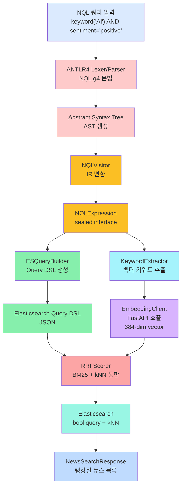
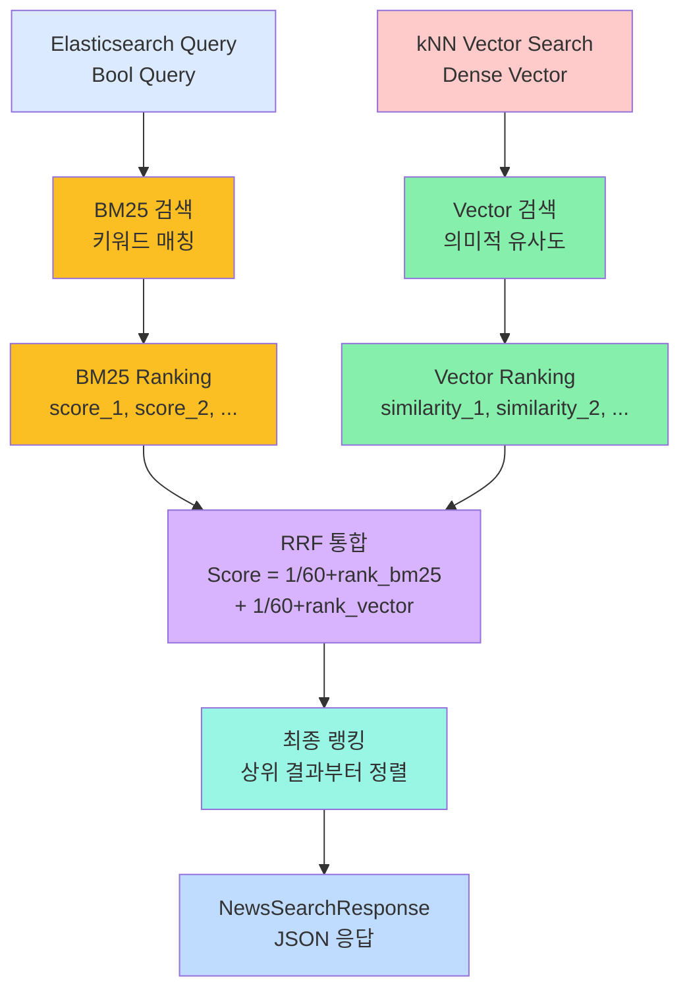

# 시각적 가이드 및 플로우 다이어그램

이 문서는 프로젝트의 주요 흐름을 시각적으로 설명합니다.

---

## 1. 전체 시스템 아키텍처

```
┌─────────────────────────────────────────────────────────────────────────────────┐
│                            N-QL Intelligence System                              │
├─────────────────────────────────────────────────────────────────────────────────┤
│                                                                                 │
│  ┌─────────────────────────────────────────────────────────────────────────┐   │
│  │                        외부 데이터 소스 (Data Sources)                    │   │
│  │  ┌─────────────┐                                    ┌──────────────┐    │   │
│  │  │  GDELT 2.0  │  (15분 주기)                       │ RSS 피드     │    │   │
│  │  │  전 세계    │                                    │ (실시간)     │    │   │
│  │  │  뉴스 이벤트 │                                    └──────────────┘    │   │
│  │  └──────┬──────┘                                           │             │   │
│  │         │                                                  │             │   │
│  │  ┌──────▼──────────────────────────────────────────────────▼──────┐     │   │
│  │  │        Message Queue (Apache Kafka, Topic: news-raw)           │     │   │
│  │  │  [Partition 0] [Partition 1] [Partition 2]                    │     │   │
│  │  └──────┬───────────────────────────────────────────┬────────────┘     │   │
│  │         │                                           │                  │   │
│  │  ┌──────▼──────────────────────┐  ┌────────────────▼──────────────┐   │   │
│  │  │   Processing Layer          │  │   Long-term Archive Layer     │   │   │
│  │  │                              │  │                               │   │   │
│  │  │  ┌──────────────────────┐   │  │  ┌─────────────────────────┐  │   │   │
│  │  │  │ news_worker.py       │   │  │  │  spark_archive.py       │  │   │   │
│  │  │  │ • Kafka Consumer     │   │  │  │  • Spark Streaming      │  │   │   │
│  │  │  │ • Embedding (384d)   │   │  │  │  • Iceberg Partition    │  │   │   │
│  │  │  │ • ES Bulk Index      │   │  │  │  • HadoopCatalog        │  │   │   │
│  │  │  └─────────┬────────────┘   │  │  └──────────┬─────────────┘  │   │   │
│  │  └────────────┼─────────────────┘  └─────────────┼────────────────┘   │   │
│  │               │                                    │                    │   │
│  │  ┌────────────▼────────────┐         ┌────────────▼──────────────┐    │   │
│  │  │ Elasticsearch (Search)  │         │ Iceberg (Data Lake)       │    │   │
│  │  │                         │         │                           │    │   │
│  │  │ • Index: news           │         │ • Table: news_archive     │    │   │
│  │  │ • Fields:               │         │ • Partitioned by date_hour│    │   │
│  │  │   - title (text)        │         │ • Columnar format (Parquet)    │   │
│  │  │   - content (text)      │         │ • Time-travel capability       │   │
│  │  │   - content_vector      │         │ • Schema evolution             │   │
│  │  │     (384d, cosine)      │         │                           │    │   │
│  │  │   - sentiment (keyword) │         └───────────────────────────┘    │   │
│  │  │   - source (keyword)    │                                          │   │
│  │  │   - publishedAt (date)  │                                          │   │
│  │  └────────────┬────────────┘                                          │   │
│  │               │                                                        │   │
│  └───────────────┼────────────────────────────────────────────────────────┘   │
│                  │                                                              │
│  ┌───────────────▼────────────────────────────────────────────────────────┐   │
│  │                    Backend API Server (Spring Boot)                     │   │
│  │                                                                         │   │
│  │  ┌──────────────────────────────────────────────────────────────────┐  │   │
│  │  │  QueryController                                                 │  │   │
│  │  │  POST /api/query                                                │  │   │
│  │  │    └─ NQLQueryParser.parseToExpression()                        │  │   │
│  │  │       └─ NQLVisitorImpl (AST → IR)                              │  │   │
│  │  │          └─ ESQueryBuilder (IR → Query DSL)                    │  │   │
│  │  │             └─ KeywordExtractor (IR 트리 순회)                 │  │   │
│  │  │                └─ EmbeddingClient (FastAPI 호출)               │  │   │
│  │  │                   └─ RRFScorer (BM25 + kNN 통합)               │  │   │
│  │  │                      └─ NewsSearchService.searchWithRrf()      │  │   │
│  │  │                         └─ Elasticsearch 검색 실행             │  │   │
│  │  │                            └─ NewsSearchResponse 반환          │  │   │
│  │  └──────────────────────────────────────────────────────────────────┘  │   │
│  └──────────────────────────────────────────────────────────────────────────┘   │
│                                                                                   │
│  ┌──────────────────────────────────────────────────────────────────────────┐   │
│  │              Frontend (Next.js 14 + React, port 3000)                     │   │
│  │                                                                           │   │
│  │  SearchPanel Component                  NewsCard Component               │   │
│  │  ┌──────────────────────────┐          ┌─────────────────────┐          │   │
│  │  │ [NQL Query Input Box]    │          │ ■ Title             │          │   │
│  │  │ ┌────────────────────┐   │          │ ■ Content (preview) │          │   │
│  │  │ │ keyword("AI") AND  │   │          │ ■ Sentiment Badge   │          │   │
│  │  │ │ sentiment != neg    │   │  ────►  │ ■ Source | Date     │          │   │
│  │  │ └────────────────────┘   │          │ ■ RFF Score         │          │   │
│  │  │ [Search] [Clear]         │          └─────────────────────┘          │   │
│  │  │ Page: 1 of 5 [< | >]     │          ■ Pagination Controls           │   │
│  │  └──────────────────────────┘          └─────────────────────┘          │   │
│  │                                                                           │   │
│  └──────────────────────────────────────────────────────────────────────────┘   │
│                                                                                 │
└─────────────────────────────────────────────────────────────────────────────────┘
```

---

## 2. NQL 쿼리 처리 플로우

**Mermaid 다이어그램:**



---

## 3. RRF (Reciprocal Rank Fusion) 스코어링

**Mermaid 다이어그램:**



**RRF 점수 계산 예시:**

| Doc | BM25 Rank | BM25 RRF | Vector Rank | Vector RRF | 총점 |
| --- | --- | --- | --- | --- | --- |
| 1 | 1 | 0.0164 | 3 | 0.0159 | 0.0323 |
| 2 | 4 | 0.0156 | 1 | 0.0164 | 0.0320 |
| 3 | 2 | 0.0161 | 2 | 0.0161 | 0.0322 |
| 4 | N/A | 0 | 4 | 0.0156 | 0.0156 |
| 5 | 3 | 0.0159 | N/A | 0 | 0.0159 |

**최종 순위 (RRF 점수 기준):**

1. Doc 3: 0.0322 (BM25 + Vector 모두 상위권)
2. Doc 1: 0.0323 (BM25 우수, Vector 양호)
3. Doc 2: 0.0320 (Vector 우수, BM25 양호)
4. Doc 5: 0.0159 (BM25만 해당)
5. Doc 4: 0.0156 (Vector만 해당)

---

## 4. Kafka 데이터 흐름

```
Producer Layer (Data Collection)
────────────────────────────────

GDELT 2.0        RSS Feed 1         RSS Feed 2       ...
(15분 주기)      (5분 주기)        (5분 주기)

│                │                  │
▼                ▼                  ▼
┌────────────────────────────────────────────┐
│     gdelt_producer.py / rss_producer.py    │
│                                             │
│  • URL 중복 제거 (RSS)                    │
│  • Metadata 추출                          │
│  • JSON 포장                              │
└────────────────┬─────────────────────────┘
                 │
                 ▼
┌────────────────────────────────────────────────────────────────┐
│ Apache Kafka Topic: news-raw                                   │
│ Partitions: 3 (parallel processing)                           │
│ Replication Factor: 1                                          │
│ Retention: 7 days                                              │
│                                                                 │
│  ┌──────────────────────────────────────────────────────────┐ │
│  │ Partition 0                                               │ │
│  │ [Msg1] [Msg2] [Msg3] [Msg4] [Msg5] ...                  │ │
│  └──────────────────────────────────────────────────────────┘ │
│  ┌──────────────────────────────────────────────────────────┐ │
│  │ Partition 1                                               │ │
│  │ [Msg6] [Msg7] [Msg8] ...                                 │ │
│  └──────────────────────────────────────────────────────────┘ │
│  ┌──────────────────────────────────────────────────────────┐ │
│  │ Partition 2                                               │ │
│  │ [Msg9] [Msg10] [Msg11] ...                               │ │
│  └──────────────────────────────────────────────────────────┘ │
└────────────────┬──────────────┬────────────────┬──────────────┘
                 │              │                │
    ┌────────────┘              │                └────────────┐
    │                           │                             │
    ▼                           ▼                             ▼

Consumer Group 1:           Consumer Group 2:         Monitoring:
news-worker                spark-archiver            Kafka UI
(Elasticsearch)            (Iceberg)                (port 8888)

│                         │
├─ Embedding (384d)        ├─ Spark Streaming
├─ Vector indexing         ├─ Iceberg writer
├─ Content indexing        ├─ Date partitioning
├─ Sentiment metadata      ├─ Schema versioning
└─ Commit offset (at-least-once)  └─ Snapshots
```

---

## 5. 데이터 저장소 비교

```
Elasticsearch (Hot Storage)          │  Iceberg (Cold Storage)
────────────────────────────────────────────────────────────────
용도: 실시간 검색                  │  용도: 장기 분석 및 아카이빙
────────────────────────────────────────────────────────────────
접근성: 매우 빠름 (~100ms)          │  접근성: 느림 (1~5s, 배치)
────────────────────────────────────────────────────────────────
저장 방식: Inverted Index            │  저장 방식: Columnar (Parquet)
────────────────────────────────────────────────────────────────
메모리: 많음 (인덱스 메타데이터)    │  메모리: 적음 (압축된 칼럼)
────────────────────────────────────────────────────────────────
스키마 진화: 가능 (복잡)            │  스키마 진화: 가능 (간단)
────────────────────────────────────────────────────────────────
타임 트래블: 제한적                 │  타임 트래블: 완전 지원
────────────────────────────────────────────────────────────────
보관 기간: 7~30일 (설정 가능)       │  보관 기간: 무제한
────────────────────────────────────────────────────────────────
쿼리 언어: Elasticsearch Query DSL  │  SQL (Spark) + 스냅샷
────────────────────────────────────────────────────────────────
비용: 높음                          │  낮음 (HDFS/S3)
────────────────────────────────────────────────────────────────

전형적인 데이터 이동:

Fresh Data                     Aged Data
(< 1 hour)                     (> 30 days)
│
Kafka
│
├──► Elasticsearch (Real-time search)
│    • API queries
│    • RFF ranking
│    • Live dashboard
│
└──► Iceberg (Archive)
     • Historical analysis
     • Trend discovery
     • Compliance
     • Cost optimization
```

---

## 6. 프론트엔드 컴포넌트 트리

```
NextJS App (port 3000)
│
├── pages/
│   ├── app/
│   │   ├── layout.tsx (root layout)
│   │   │   ├── <head>: metadata
│   │   │   └── <body>: main layout
│   │   │
│   │   └── page.tsx (root page)
│   │       └── <SearchPanel />
│   │
│   └── api/
│       └── (없음, Spring Boot 백엔드 사용)
│
├── components/
│   ├── SearchPanel.tsx
│   │   ├── State: [query, results, page, loading]
│   │   ├── Methods: handleSearch(), handlePageChange()
│   │   │
│   │   ├── <input> NQL Query
│   │   ├── <button> Search / Clear
│   │   ├── <div> Loading Spinner (conditional)
│   │   ├── <div> Error Message (conditional)
│   │   │
│   │   └── <NewsCard /> (map over results)
│   │       └── {...item} (individual news)
│   │
│   └── NewsCard.tsx
│       ├── Props: {id, title, content, source, sentiment, publishedAt, rffScore}
│       ├── <h2> title
│       ├── <p> content (truncated)
│       ├── <span> sentiment (badge: positive/neutral/negative)
│       ├── <span> source
│       ├── <span> publishedAt (relative time)
│       └── <span> rffScore (2 decimals)
│
├── styles/
│   ├── globals.css
│   ├── SearchPanel.module.css
│   └── NewsCard.module.css
│
├── public/
│   ├── favicon.ico
│   └── ...
│
├── .env.local
│   └── NEXT_PUBLIC_API_URL=http://localhost:8080
│
├── tsconfig.json
├── next.config.js
└── package.json
```

---

## 7. 에러 처리 플로우

```
User Query
│
├─ NQL Parsing Error
│  │
│  ├─ TokenError (unknown token)
│  │  └─ Response: 400 Bad Request
│  │     {"error": "Query parsing failed", "message": "..."}
│  │
│  ├─ SyntaxError (invalid grammar)
│  │  └─ Response: 400 Bad Request
│  │
│  └─ SemanticError (unknown field)
│     └─ Response: 400 Bad Request
│
├─ Elasticsearch Error
│  │
│  ├─ Connection Error (unreachable)
│  │  └─ Response: 503 Service Unavailable
│  │
│  ├─ Timeout Error (slow response)
│  │  └─ Response: 504 Gateway Timeout
│  │
│  └─ Query Error (invalid DSL)
│     └─ Response: 400 Bad Request
│
├─ Embedding Error (non-fatal)
│  │
│  └─ FastAPI Unreachable
│     └─ Graceful Degradation: BM25만 사용
│        └─ Response: 200 OK (with degradation flag)
│
├─ Pagination Error
│  │
│  ├─ Page out of range
│  │  └─ Return empty array
│  │
│  └─ Invalid size
│     └─ Clamp to [1, 100]
│
└─ Success
   └─ Response: 200 OK
      {"total": 45, "items": [...], "page": 1}
```

---

## 8. 성능 특성

```
Metrics by Query Complexity
────────────────────────────────────────────

Simple Query: keyword("AI")
├─ NQL Parsing: 3ms
├─ ESQueryBuilder: 2ms
├─ ES BM25 Search: 80ms
├─ RRF Scoring: 15ms
└─ Total: ~100ms ✓ (매우 빠름)

Medium Query: keyword("AI") AND sentiment = "positive" AND source IN [...]
├─ NQL Parsing: 5ms
├─ Embedding: 120ms
├─ ES Search: 150ms
├─ RRF Scoring: 25ms
└─ Total: ~300ms ✓ (빠름)

Complex Query: (...) AND (...) OR NOT (...) AND ...
├─ NQL Parsing: 8ms
├─ Multiple Embeddings: 200ms
├─ ES Complex Bool: 250ms
├─ RRF Scoring: 35ms
└─ Total: ~500ms ✓ (양호)

Worst Case: Very large result set (10,000+)
├─ ES Query: 500ms
├─ RRF Scoring: 150ms (large ranking list)
├─ JSON Serialization: 50ms
└─ Total: ~700ms ⚠ (느림, 페이지네이션 권장)

Optimization Tips:
─────────────────
1. 페이지네이션 사용 (size: 20)
2. 날짜 범위 필터 추가
3. 복잡한 OR 쿼리 피하기
4. 벡터 검색이 필요 없으면 문법 생략
```

---

## 9. 배포 토폴로지 예시

```
Production Environment (고가용성)
════════════════════════════════════

┌────────────────────────────────────────────────────────────────┐
│                    Load Balancer (nginx)                       │
│                                                                 │
│  traffic.example.com/api/query                               │
│  traffic.example.com/api/search                              │
│  traffic.example.com                    (Frontend)            │
└──────────────────┬──────────────────────┬─────────────────────┘
                   │                      │
        ┌──────────┴──────────┐          └────────────────────┐
        │                      │                               │
        ▼                      ▼                               ▼
    ┌─────────┐            ┌─────────┐                   ┌──────────┐
    │Backend-1│            │Backend-2│                   │Frontend  │
    │(Spring  │            │(Spring  │                   │(Next.js) │
    │Boot)    │            │Boot)    │                   │Pod       │
    │:8080    │            │:8080    │                   │          │
    └────┬────┘            └────┬────┘                   └────┬─────┘
         │                       │                            │
         └───────────┬───────────┘                            │
                     │ (Service Discovery)                    │
                     │                                        │
                     ▼                                        │
         ┌──────────────────────┐                           │
         │  Elasticsearch Cluster │                         │
         │  (3 nodes, HA)       │                           │
         │                      │◄─────────────────────────┘
         │  • Index: news       │                  (GET /api/query)
         │  • Shards: 5         │
         │  • Replicas: 2       │
         └──────────┬───────────┘
                    │
         ┌──────────┴──────────┐
         │                      │
         ▼                      ▼
   ┌──────────┐            ┌──────────┐
   │ Kafka    │            │ Iceberg  │
   │ Cluster  │            │ Storage  │
   │(3 brokers)           │(HDFS)    │
   │          │            │          │
   │ news-raw │            │ data-lake│
   │ topic    │            │ catalog  │
   └──────────┘            └──────────┘
```

---

**마지막 업데이트:** 2026-04-22
